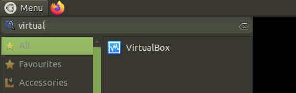
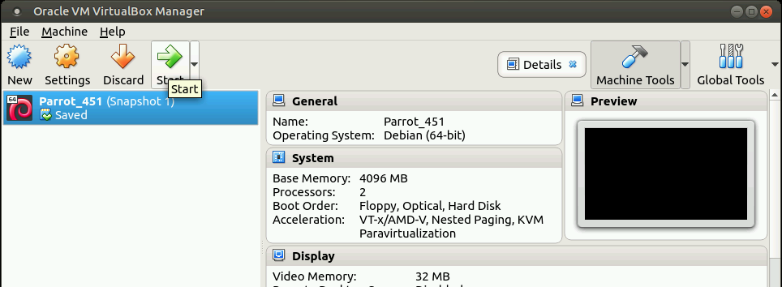
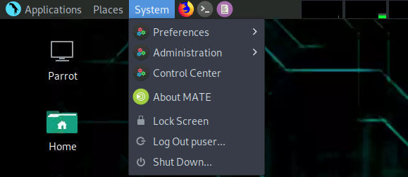
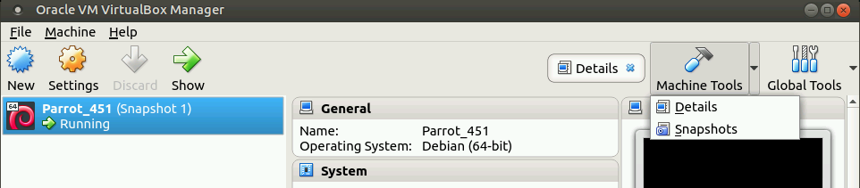
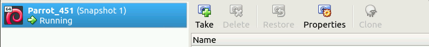
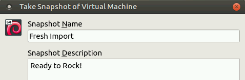
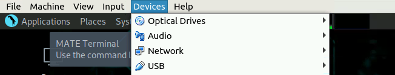
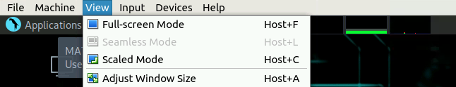

# Wireless Labs and Hands-on Exercises<

## Section 0 Working with VirtualBox (Part 1)

You will be using a Linux guest virtual machine for many of these
labs. This will give you the ability to create snapshots of the guest
without having to change any of the settings or privileges of the host
operating system. The hypervisor you will use is VirtualBox and has an
already imported guest virtual machine.

1.  Start the VirtualBox VM manager from the host’s main menu.



2.  Select the Parrot virtual machine and **start** it using the main
    action buttons at the top.



3.  Log into the virtual guest with the password P@ssw0rd! The screen
    resolution may not be ideal. To help remedy this, restart the
    virtual guest machine. The display manager for the guest should then
    recognize the current screen resolution. To restart the guest
    operating system, navigate to the top menu bar, select System, then
    **Shutdown**. This will pop up another window and select
    **Restart**.

>  style="width:4.49628in;height:1.94916in" />

If you are prompted to check for updates, select **No**. Periodically,
in some of the following exercises, you will manually update and
install selected tools. Before getting into any of the exercises, you
should create a snapshot of the Linux guest machine in the event a
manual install does not go as expected or you inadvertently hose up
your guest.

4.  Create the snapshot by selecting **Machine Tools**, then
    **Snapshots** in the upper action menu bar of the VirtualBox
    Manager. This will present the Snapshots menu. From within the
    Snapshot menu, select Take. Add a Snapshot Name and a short
    description. When you need to revert to the clean snapshot, you can
    **Restore** to the snapshot from the same menu selection.







Occasionally during some of the exercises, you will need to attach a USB device
to your virtual guest so you can use it. The physical act of plugging in a USB
device to the host operating system does not automatically allow the guest
machine to use it. You will need to attach it through the VirtualBox Manager
while the guest is running. The location of where the guest virtual machine
menu appears will depend on whether you are in full screen mode with the guest
or not. The menu will appear either at the top or in a slightly hidden tab at
the bottom.




After you locate the guest machine manager menu, select **Devices**,
then **USB**. From here you should have boxes next to the enumerated
USB devices plugged into the physical machine. Check the USB device
that you want to use. It will likely be a WLAN (wireless) device for
the exercises. After you check the box, it will then be available to
the guest Linux virtual machine. In the event the device is physically
unplugged, you will have to go through these same steps to make it
available again.

You can pop in and out of **full screen mode** with the virtual guest
by going back to the guest machine manager menu. Select **View**, the
**Full-screen Mode**. You can also toggle these modes from the
keyboard by hitting the **right-CTRL + F**. The right-CTRL button is
also known as the Host key.

>  style="width:6.1251in;height:1.17594in" />

Throughout the course, you will need to accomplish many tasks from the
Linux command line. To access the Linux command line interface, you
must open up a Linux terminal window. Inside the guest operating
system, the terminal window icon located in the top menu bar. The icon
looks like a gray circle with a greater than sign and an underscore.


The terminal you open will put you into the command line interface as
a normal user in your home directory (folder). Your user has
administrator privileges, but you need to call them using another
command, **sudo**, which you will use later in many of the exercises.
For now, just be aware of the situation and where you are in the
command line directory structure.

## Section 0 Getting Comfortable with Linux Commands (Part 2)

Open up a terminal window on your Linux box and use the **whatis** and
**man** pages to find basic information about the following commands:

sudo: allows a permitted user to execute a command as root or another
user. It may require a normal user to authenticate with a password
upon its invocation.

 * cp:
 * apt:
 * cat:
 * cd:
 * file:
 * find:
 * grep:
 * gzip:
 * head:
 * ifconfig:
 * ifdown:
 * ifup:
 * iw:
 * iwconfig:
 * less:
 * lsusb:
 * macchanger:
 * mkdir:
 * ps:
 * pwd:
 * rm:
 * tail:
 * tar:

 ##  Section 0 Preparation of the Platform (Part 3)

Inside of your home directory **/home/puser** is another directory named
**Captures/.** Inside the Captures directory are two zipped files,
**mod_rockyou.txt.gz** and **wireless_survey.7z**. Extract the
**wireless_survey.7z** file using the **7za** utility from the command
line. This will create a new **wireless_survey** directory that will
contain about 50 additional files.

```bash
cd ~/Captures # change into the Captures directory
7za –help # look at the output and options
7za x wireless_survey.7z # x to extract the 7zip’d file

```

Next, unzip the dictionary file, mod_rockyou.txt.gz. This file contains
about 14 million lines each with what could be thought of as possible
passwords that could be used in a brute force or dictionary attack. It’s
a generic dictionary that can be used with lots of command tools. You
will use this file later when trying to recover wireless network
passphrases.

```bash
gzip -d mod_rockyou.tx.gz
```

Use the word count command line tool to tell you how many lines are in
the file. Then follow up that command by examining the first 20 lines of
the dictionary. The dictionary contains words that some people may find
offensive but could be a password used in a target network.

```bash
wc -l mod_rockyou.txt # The output is the number of lines in the file

head -20 mod_rockyou.txt # First 20 lines are displayed
```

**Note on the sudo command**: Many administrative tools and commands
executed in Linux require root privileges or at least the effective user
id (UID) of root to run, otherwise an error will likely be thrown. You
may need to prepend admin or root commands with sudo, e.g. **sudo
ifconfig eth0.** When prompted for the password, use **P@ssw0rd!** as
appropriate.

**Comments on research**: These labs are used to help reinforce some of
the concepts presented in the training material. Several sections
require you to conduct open source research to find answers or clues to
completing some steps throughout. Your future work in this and other
cyber related fields involves quite a bit of research, hopefully, from
reputable locations. You might or might not be surprise at what you can
find or leverage to get into a network. This could include the latest
vulnerabilities and exploits, or just enough background to help
understand a problem. **Never give up**.

**Wireless adapter naming convention workaround**: Newer versions of
Linux will use adapter naming conventions that are unlike what you may
have seen in the past. For example, what would be enumerated in older
versions of Linux as the first wireless adapter (**wlan0**) might be now
enumerated as something like `wlx00c0ca8f2ae9.` As root adjust the
following commands to fit your setup:

```bash
ifconfig wlx00c0ca8f2ae9 down
ip link set wlx00c0ca8f2ae9 name wlan0 # Temporary alias
ifconfig wlan0 up
```

