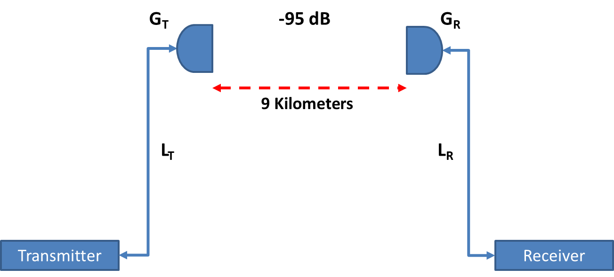

# Section 3 RF Math

> Knowing the absolute power of a system is important when calculating
> EIRP. EIRP is one of those characteristics that a local regulatory
> domain authority dictates. The max EIRP depends on all component of a
> system and has different maximums depending on the use of the system.
> The uses can be either indoors or outdoors on links.
>
> Calculate the absolute power in mW for the following:

1.  100 mW transmitter with 24 dBi antenna
    \_\_\_\_\_\_\_\_\_\_\_\_\_\_\_\_\_\_\_\_\_\_\_\_\_\_\_\_\_\_\_\_\_

| Starting power | Increment/Decrement | Resulting power |
|----------------|---------------------|-----------------|
| 100 mW         | \+ 10               | 1,000 mW        |
| 1,000 mW       | \+ 10               | 10,000 mW       |
| 10,000 mW      | \+ 10               | 100,000 mW      |
| 100,000 mW     | \- 3                | 50,000 mW       |
| 50,000 mW      | \- 3                | **25,000 mW**   |

2.  300 mW transmitter with 16 dBi antenna
    \_\_\_\_\_\_\_\_\_\_\_\_\_\_\_\_\_\_\_\_\_\_\_\_\_\_\_\_\_\_\_\_\_

3.  1 mW transmitter with 9 dBi antenna
    \_\_\_\_\_\_\_\_\_\_\_\_\_\_\_\_\_\_\_\_\_\_\_\_\_\_\_\_\_\_\_\_\_\_\_\_

> The signal to noise ratio is another characteristic of a network to
> consider. The SNR can be measured and assessed to determine if the SNR
> is good or poor. Good SNR is key to high data rates and reduced SNR
> will reduce data rates and introduce error rates and can contribute to
> STAs roaming to stronger signaling APs.
>
> What is the SNR and is it good or poor?

4.  Noise floor -95 dB and a RSSI of -70 dB
    \_\_\_\_\_\_\_\_\_\_\_\_\_\_\_\_\_\_\_\_\_\_\_\_\_\_\_\_\_\_\_

5.  Noise floor or -100 dBm and a RSSI of -83 dBm
    \_\_\_\_\_\_\_\_\_\_\_\_\_\_\_\_\_\_\_\_\_\_\_\_\_\_\_\_

Find a cable manufacturer and a cable loss calculator.

6.  Determine the loss in dB for 50 feet of LMR-400 cable for a system
    operating on channel six.
    \_\_\_\_\_\_\_\_\_\_\_\_\_\_\_\_\_\_\_\_\_\_\_\_\_\_\_\_\_\_\_\_\_\_\_\_\_

7.  Determine the loss in dB for 75 feet of LMR-400 for the same system
    on channel six.
    \_\_\_\_\_\_\_\_\_\_\_\_\_\_\_\_\_\_\_\_\_\_\_\_\_\_\_\_\_\_\_\_\_\_\_\_\_\_\_\_

> Determining a Link Budget is critical to successful 802.11
> communications over distance.

**RX Threshold = -80 dBm**

**TX = +20dBm**
