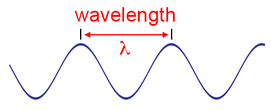
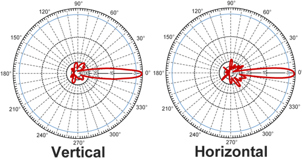
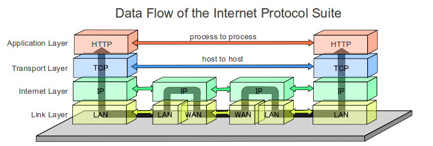

# Wireless Networking I:Integration and Troubleshooting

---

---

# Overview

Staff & Facilities

Topics of Instruction

---

# Staff and Facilities

* Introductions
  * Background\, strengths\, experience\, what you want to accomplish with this course\, how will you use this course?
* Facilities Overview
* Network Setup and Configuration
* Class Hours

---

# Topics of Instruction

Overview of Standards\, Organizations\, and Fundamentals

RF Fundamentals\, Components\, and Math

802\.11 Standards

Wireless Networks and Spread Spectrum Technology

Lots about WLAN

802\.11 Security

Site Surveys

Power over Ethernet \(PoE\)

802\.11n aka High Throughput

802\.11ac aka Very High Throughput

It’s a Party\, so BYOD\!

---

# Overview

Wireless Standards

Organizations

Fundamentals

---

# Radio Frequency

Fundamentals

Components

Measurements and Math

Signal and Antenna Concepts

---

# 802.11 Standards

Original Standard

Amendments

802\.11\-2016 Consolidation

---

# Wireless Networks

ISM and UNII bands

Spread Spectrum Technology

OFDM

Channel Selection

---

# WLANs

Topologies

802\.11 Medium Access

802\.11 MAC Architecture

WLAN Architecture

Deployments and Vertical Markets

Troubleshooting and Design

---

# Network Security

Legacy Security

RSN

Segmentation

VPNs

Guest Access

Wireless Attacks and Monitoring

Policy

---

# Site Surveys

Radio Frequency Site Surveys

Site Survey Systems

Survey Devices

Coverage vs Capacity Analysis

---

# Power over Ethernet

History

802\.3af

802\.3at

PoE Devices

802\.11n and 802\.11ac

---

# 802.11n

High Throughput

MIMO

Channels

Operation

---

# 802.11ac

Very High Throughput

MIMO and MU\-MIMO

Channels

Operation

---

# BYOD

Mobile Device Management \(MDM\)

Guest Access

Network Access Controls \(NAC\)

---

# Administrivia

* Create a single folder on Desktop
  * Save anything there and nowhere else
* Open wireless network—use at your own risk
* Virtual guest machine: Parrot OS
* Make no assumptions

---

# questions??

---

# Standards, Organizations, and Fundamentals

---

---

# Overview

* Standards Organizations
* Core\, Distribution\, Access
* Communication Fundamentals
* Maps to CWNA Objective
  * WLAN Regulations and Standards

---

# Standards Organizations

Institute of Electrical and Electronics Engineers \(IEEE\)

Internet Engineering Task Force \(IETF\)

Wi\-Fi Alliance

International Organization for Standardizations \(ISO\)

---

# Local Regulatory Domain Authority

* Licensed and unlicensed communications are regulated in these areas:
  * Frequency
  * Bandwidth
  * Max Power Output
    * Max IR and Max EIRP
  * Indoor/outdoor use
  * Spectrum sharing \(e\.g\. 802\.11h\)

---

802.11h DFS and TPC

---

# Local Authorities

* International Telecom Union\-Radiocommunication \(ITU\-R\): United Nations
  * Administrative and Radio Regulatory Regions
  * Coordinate EM spectrum management
* Region A \(Americas\)
* US: Federal Communications Commission
* Key take\-away is how communications are regulated\.

---

There are 5 administrative regions.  And each region has one or more local regulatory domain authorities. 

---

# IEEE

* Leading professional association for the advancement of technology
* Creates the standards for communications
  * 802 Project
* Standards working groups tackle problems or needs
  * 802\.3 \(Ethernet\) 802\.11 \(WLAN\)
* Written documentation of the technical processes and equipment functions

---

# Standards Hierarchy

802\.3 Working Group

802\.15 Working Group

802\.11 Working Group

802\.11a Task Group

802\.11ad Task Group

---

802 project is the LAN/MAN standards committee
802.11 was the 11th group under 802 project. 

Standards are created by the working group and updated by task groups through amendments.

---

# IETF

* Under the Internet Society \(ISOC\)
* Making the Internet work better\!
* Develop protocol standards
* Best practices
* Informational documents
* Request for Comments
  * RFCs 3478\, 2865\, and 5415

---

EAP, RADIUS, CAPWAP

CAPWAP replaces LWAPP (Lightweight Access Point Protocol)

GRE is under 1701 if neither CAPWAP or LWAPP is not used. 

---

# Wi-Fi Alliance

Originally the WECA

Global industry association that promotes the growth of Wireless LANs

Certification testing and programs

Interoperability and compatibility  of WLAN products against the IEEE standards

Independent testing of products in 8 countries

---

# Some Wi-Fi Alliance Certifications

Wi\-Fi Multimedia \(WMM\)

Wi\-Fi Certified ac

Wi\-Fi Protected Setup \(WPS\)

Wi\-Fi Direct

Voice Programs

Tunneled Direct Link Setup

Hotspot 2\.0

Passpoint

---

# Core, Distribution, Access

* Roles used to describe the networking architecture
* Core: High speed switching and backbone
  * Fastest and redundancy built\-in
  * WLAN Controllers
* Distribution: Routes to smaller node clusters or nets
  * VLANs and Subnets
  * Wireless Bridges and WLAN Controllers
* Access: Slower delivery to end users and nodes
  * Access Points

---

# Comms Fundamentals

* Carrier Signals
  * Distinguish between 0s and 1s
  * Through modulation
* Amplitude \(Power\)
* Frequency \(Hz\)
* Wavelength \(Measurement\)
* Phase \(Comparison\)

---

Carrier signals are modulated to represent meaningful information.

---

# Comms Keying Methods

* Amplitude Shift
  * Current state technique
  * Symbol period
* Frequency Shift
  * Current state technique
  * Symbol period
* Phase Shift
  * Used in 802\.11
  * Differential \(degree of difference\)

---

# Summary

Lots of basics

Standards Organizations

Local Regulatory Domain Authorities

Core\, Distro\, and Access

RF and Comms basic basics

Keying and modulation basics

---

# Lab: Research

Open source research locally and online

Section 0 and 1 Exercises

Do it\!

---

# questions??

---

# RF Fundamentals

---

# 

---

---

# Overview

* Waves
* RF Characteristics
* RF Behaviors
* Maps to CWNA Objective
  * RF Technologies

---

# Waves

* Motion or oscillation through space or matter
* Electromagnetic wave is an oscillation
* Two sub\-components
  * Electric Fields
  * Magnetic Fields
* Magnetic field can create an electric field and vice versa

---

Magnetic field is a force produced by a moving electric charge around a magnet or free space.

---

# EM Waves

The current in the antenna generates a magnetic field

Magnetic and Electric fields are offset 90 deg

Basic conceptual wave is a sine wave

---

Magnetic field generates an electric field and so on 

---

# RF Characteristics

Generated alternating current \(AC\) signal

Sine wave is the oscillation

~300\,000\,000 m/sec or 300\,000 km/sec

Wavelength\, frequency\, amplitude\, phase

---

# Wavelength

Measurement of distance

Inverse relationship between freq \(f\) and wavelength \(λ\)   λ = 300\,000\,000/f

Higher frequency = smaller wavelength

* RF signals attenuate through space and matter
* Distance = attenuation
* Higher frequencies attenuate faster
  * Free Space Path Loss \(FSPL\)
  * Higher freqs penetrate less
* 2\.412 GHz ≈ 12\.44 centimeters ≈ 4\.9 inches
* So what? Antenna diversity\!
* Speed of light \(c\) ~ 300\,000\,000 meters/sec

---

One of the FSPL formula variables is frequency

Obstructions cause attenuation as the signal passes through it

Knowing the wavelength can come into play when calculating distance for antenna diversity

---

# Frequency

Cycles per second \(Hertz\)

Past a given point

1 Hertz = 1 cycle / second

Kilo = 1\,000

Mega = 1\,000\,000

Giga = 1\,000\,000\,000

---

# Amplitude

* Signal strength or power
* Height of the wave \(max \+/\-\)
* Independent of frequency and wavelength
* Transmit amplitude
* Receive amplitude
  * Site survey measurements
* Increase in amplitude extends the range of an RF wave

---

Transmit amplitude is the initial amplitude that leave the transmitter
Receive amplitude is the strength of the signal when it reaches the receiver

Site Surveys measure receive signal strength which is receive amplitude

---

# Phase

Comparison of signals

0\-359 degrees of relationship

Alignment and misalignment

Constructive or destructive

Multipath effects based on phase

---

Signals arriving in-phase will increase the strength of the received signal however the received signal will never be stronger than the original transmitted signal.

---

# RF Behaviors

Waves passing through air and other mediums

Absorbed

Reflected

Scattered

Refracted

Diffracted

Attenuated

Multipath\!

---

# Absorption

Signals passing through an object or medium

Directly affects the amplitude

Brick walls versus drywall

User density

Water in objects

---

Drywall would be an example of absorbing material.  

---

# Reflection

* Bouncing off in another direction
* Skywave or Microwave reflections
  * Reflections below 1 GHz
  * Reflections above 1 GHz
* Microwave reflection in WLANs
* Indoors
* Outdoors
* Think of echoes

---

Skywave < 1GHz
Microwave 1GHz – 300 GHz

Indoors: metal objects, glass, concrete
Outdoors: smooth surfaces such as roads, bodies of water, buildings

---

# Scattering

AKA scatter

Multiple reflection in many directions

Uneven surfaces

Concern is focused on outdoor objects

---

Chain link fences, trees, rocky terrain

---

# Refraction

* Bending through different densities
* Atmospheric conditions
* Long distance bridge links
* K\-factor
  * Less than or greater than 1
  * Normally 4/3 or >1
* Water vapor\, air temp and pressure differences

---

Atmospheric conditions are what we are concerned with

K-factor: 
Less than 1, away from the surface of the earth
More than 1, towards
1 = no bending

---

# Diffraction

* Bending around an object or obstruction
* Longer signal paths
* RF shadow
* Outdoors
  * Hills
  * Buildings
* Mounting surface and antenna locations

---

RF Shadow is a dead zone of coverage of degrade signals

Careful selection of mounting location and antenna locations may create blind spots

---

# Gain

AKA amplification

Positive amplitude difference

Active vs passive

Intentional and unintentional

Spectrum Analyzer \(frequency domain\)

Oscilloscope \(time domain\)

---

Unintentional gain example would be two signals arrive in-phase to a receiver. 

* Active gain through amplifiers
  * Fixed gain
  * Fixed output
* Passive gain with antennas
  * Focus the energy more effectively
  * Propagate the signal in a desired direction

---

# Loss

* Negative amplitude difference
* Intentional
* Unintentional or natural loss
  * Process of RF propagation
  * Media
  * Space
  * Distance

---

# Loss from Attenuation

Reduction of signal strength

Impedance from cables and connectors

May add intentional impedance

Signals passing through objects

Function of distance

---

May want to add impedance to meet Local Domain authorities such as FCC regulations IR and EIRP

Water absorbs lots of signal amplitude

---

# Free Space Path Loss (FSPL)

Natural broadening of waves

Beam divergence

2\.4 GHz signal will lose about 80 dB in 100m

6 dB loss rule

FSPL is a function of  frequency and distance

---

6dB loss rule: as distance doubles, amplitude loss of 6dB

FSPL is based on frequency and distance

---

# Multipath

* The bane of  legacy  802\.11a/b/g
* Signals arriving out of time and phase
  * nanoseconds
* Results of reflection\, refraction\, diffraction\, and scattering
* Indoors and outdoors
* Delay spread

---

Outdoors as a result of flat roads, bodies of water, and atmospheric conditions

Delay spread is the time differential of the multiple paths of a single signal

* Upfade = 0\-120 degrees
* Downfade = 121\-179 degrees
* Nulling = 180 degree
* Data corruption
  * Intersymbol Interference \(ISI\)
  * Bit overlap
* Countered with directional antennas and antenna diversity; reducing power output

---

# Summary

RF characteristics

Multipath resulting from RF Behaviors

FSPL \(distance and frequency\)

Ways to counter multipath

Gain

---

# Lab: Section 2

* Calculate the wavelengths in cm and inches to understand antenna diversity:
  * Channel 6 \(2\.437 GHz\) in 2\.4GHz ISM band
  * Channel 11 \(2\.462 GHz\)
  * Channel 36 \(5\.180 GHz\) in UNII\-1
* Inverse relationship between freq \(f\) and wavelength \(λ\)   λ = c/f
* GHz = 1\,000\,000\,000 \(1 billliiiiooonnn\)

---

Example 4.9 GHz = (300,000,000 m/s ) / (4,900,000,000 cycles/sec) = 0.0612 m/cycle = 6.12 cm/cycle

Note that 300,000,000 m = 30,000,000,000 cm

2.437 GHz = 4.8 inches and 12.3 cm 
2.462 GHz = 4.8 inches and 12.2 cm
5.180 GHz = 2.3 inches and 5.8 cm

---

# questions??

---

# RF Components, Measurements, and Math

---

# 

---

---

# Overview

* RF Communications Components
* Units of Power and Comparison
* RF Math
* Additional Concepts and Terms
* Maps to CWNA Objective
  * RF Technologies

---

# RF Components

* __Transmitter:__  Modulates the AC signal
* Carrier signal
* Power level \(local regulatory domain\)
  * Typically 100mW or less for APs
  * Clients at a fraction of the AP power
* Transceiver
* Carrier signal is passed through cable or directly to the antenna

---

Modulation of the AC signal to encode the binary data into a carrier signal

Amplitude and phase shifting modulation is used in WLAN. FSK is not

* __Antenna: __ Dual functioning device
* Referenced to Isotropic Radiator
  * Equally in all directions\, ideally
  * Point source
  * Not to be confused with Intentional Radiator

---

Radiates RF waves or collects RF waves

* __Receiver:__  Translates the carrier signal back into bits
* Sensitivity of the receiver varies
* Can “hear” better in several ways
  * Antenna
  * Amplifiers
* Susceptible to interference

* __Intentional Radiator \(IR\):__  “Device that intentionally generates and emits RF”
* Up to but not including the antenna
* Sum of all components
  * Transmitter
  * Cables and connectors
  * Amplifiers\, etc\.
* Measured at the connector at the antenna
  * Milliwatts \(mW\) or dBm

---

dBm is decibels relative to 1 milliwatt

* __Equivalent __  __Isotropically__  __ Radiated Power \(EIRP\): __ Highest RF power transmitted from the antenna
* Local regulatory domain authority limits the EIRP from the antenna
  * Indoors vs outdoors
* Antenna gain
* Typical indoor WLAN transmit power: 1\-100 milliwatts

---

This matters when you start adding passive and active gain component. 

Indoors 1 watt and outdoors 4 watts. 

---

# Units of Power and Comparison

* Absolute  __power__  measures TX and RX amplitude
  * Watt \(W\)
  * Milliwatt \(mW\) 1/1000th of a Watt
  * Decibels relative to 1 milliwatt \(dBm\)
* Relative units of  __comparison__
  * Decibel \(dB\)
  * Decibel relative to an isotropic radiator \(dBi\)
  * Decibel relative to a ½ wave dipole antenna \(dBd\)

---

# Unit of Power: dBm

Used to compare a signal to 1 milliwatt

Absolute measure of power

0 dBm = 1 milliwatt

30 dBm = 1 watt

Easier to express in dBm than 0\.000000001 milliwatts

Can you have negative dBm?

---

# Unit of Comparison

* Decibel \(dB\): comparative unit
* Connectors and cabling
  * Cabling dB loss is typically measured per 100 ft
* Rule of 6 dB
  * Doubling the distance incurs a 6 dB loss in signal
  * Increase of 6 dB gain double the useable distance

* dBi: measurement of antenna gain
  * 0 dBi is a no gain antenna or  unity\-gain  antenna
  * __Half dipole __ antenna has a dBi of 2\.14
  * Most antennas are advertised as dBi
* dBd: increase of gain relative to a  __dipole__  antenna
  * Dipoles are omnidirectional antennas
  * Add 2\.14 to dBd to get dBi

---

# RF Math

* Addition and subtraction based on 3 and 10
* Multiplication and division based on 2 and 10
* Rule 3s
  * 3 dB gain or loss effectively doubles or halves the absolute power\, respectively
* Rule of 10s
  * 10 dB gain or loss effectively multiplies or divides by a power of 10

---

# Additional Terms and Concepts

Noise Floor

Signal\-to\-Noise Ratio \(SNR\)

Received Signal Strength Indicator \(RSSI\)

Link Budget

Fade Margin

System Operating Margin \(SOM\)

---

Show RSSI on a wireless adapter.

---

# Noise Floor

Background radio energy

Interference from non\-radio devices

Increase in amplitude of noise floor

What is in the background that can create a higher noise floor?

Noise floor is typically lower in the 5 GHz bands\. Why?

---

Noise floor is never guaranteed or assumed. In 2.4 it may be as low as -100 or as high as -90. 

In 5.0 it may be as low as -105

---

# Signal-to-Noise Ratio

Not a real ratio

Difference between the received signal and noise floor

SNR of 25dB or greater is  __good__  signal quality

SNR of 10dB or less is  __poor__  signal quality

---

# Received Signal Strength Indicator

Required receive sensitivity of the device

Dictates network speed \(dynamic rate switching\) and roaming

Lower received signal drops data rate

Vendor defined thresholds

---

# Link Budget

* Sum of all expected losses and gains through the RF medium \(air and  __FSPL__ \)
* Active and passive gains
* Determines if the received signal is above the receiver’s sensitivity threshold
* Insertion loss
  * Cables per 100 feet based on vendor specs
  * Connectors ~0\.5 dB loss

---

Insertion loss is anything add into a radio system that introduces signal attenuation.

Timesmicrowave.com coaxial cable calculator; can calculate with cable alone or as an assembly

What is FSPL based on? Frequency and Distance.

---

# Fade Margin

* Buffer between the calculated RX signal strength at the receiver and the receiver’s sensitivity threshold
* Common practice is 10\-25 dB above threshold
  * 10 dB is minimum for < 3 miles
  * 15 dB for 3 up to 5 miles
  * 25 dB for links > 5 miles
* Reliability of a link is increased with larger fade margins

---

# System Operating Margin

SOM is the  actual measured  buffer

After the Link Budget is calculated and Fade Margin is determined

How much additional loss can a link tolerate?

Can be measured using attenuators

---

# Summary

RF Communications Components

Units of Power and Comparison

Conversions for the exam

RF Math

Additional Concepts and Terms

---

# Lab: Section 3 RF Math

* Calculate the absolute power in mW
  * 100 mW transmitter with 24 dBi antenna
  * 300 mW transmitter with 16 dBi antenna
  * 1 mW transmitter with 9 dBi antenna
* What is the SNR and is it good or poor?
  * Noise floor \-95 dBm and a RSSI of \-70 dBm
  * Noise floor or \-100 dBm and a RSSI of \-83 dBm

---

Remember 25 dB SNR is good, 10 dB or less is poor.

---

# Lab: Link Budget

Two connectors per length of cable \(round to nearest whole number\)

Channel 6 in 2\.4 GHz ISM band

50 feet LMR\-400 cable on Transmitter side; 75 feet on Receiver end

24 dBi parabolic grid antennas

__RX Threshold = \-80 __  __dBm__

---

Pay attention to distances and frequency units of measure

Timesmicrowave.com coaxial cable calculator; can calculate with cable alone or as an assembly

Channel 6 = 2.437 GHz or 2437 MHz (MHz is what’s needed for the online calculator)
LMR-400 50 feet (3.8 dB with connectors, 3.3 without)
LMR-400 75 feet (5.6 dB with connectors, 5.0 without)
Based on distance greater than 5 miles, at least 25 dB is needed for Fade Margin

---

# questions??

---

# RF Signal and Antenna Concepts

---

---

# Overview

* Antennas
* Beamwidth
* Lines of Sight
* Fresnel Zone and Earth Bulge
* MIMO
* Antenna Connectors and Installation
* Antenna Accessories
* Local Regulatory Domain
* Maps to CWNA Objectives
  * RF Technologies

---

# The Antenna

Radiating element in the system

Causes RF waves to propagate through space

Receives RF signals

Built for purpose and coverage

---

# Antenna Charts

* Antennas are designed purposely
  * Omni vs Directional
* Azimuth and elevation charts pictorially represent the RF patterns \(polar charts\)
* Azimuth charts are top\-down view
  * Horizontal plane \(H\-plane\)
* Elevation charts are side view
  * Elevation plane \(E\-plane\)

Measured in degrees and do not represent distance or power\, rather the pattern

Help visualize the RF patterns and extrapolate the Beamwidth\.

6 dB loss halves the usable distance

10 dB loss cuts distance by 70%

---

# Omnidirectional Antenna Chart

---

# Directional Antenna Chart

---

# Directional Antenna Lobes

---

# Beamwidth

How broad or narrow the RF pattern

\-3 dB power points \(half\-power\)

Calculated vertically and horizontally

Side lobes can mess you up

---

Refer to page 115 in the book to discuss beamwidth and how to determine it

---

# Antenna Types

* __Omnidirectional__
* 360 degree when viewed from above
* Donut shaped from the E\-plane
  * Rubber ducks
  * Higher gain = squashed donut

---

High gain omnis in elevated positions

Omni for edimax.com

* __Semi Directional__
* Short to medium distances
  * Up to 1 mile
* Indoors directional coverage
  * Libraries\, warehouses\, retail
  * Long hallways
  * Minimize multipath in legacy a/b/g WLANs
* Beamwidths of 180 degrees or less
* Patch\, panel\, planar
* __Yagi__  for links up to 2 miles

---

Yagis are normally 90 degress or less 

Semi-directional can be used to create external only hotspots

Yagi picture from wpsantennas.com

Patch antenna from l-com.com

__Highly directional__

Narrow beamwidth

Parabolic dish and grid

Point\-to\-point

Bridge links

Consider wind\-loading

__Sector Antennas__ \, typically back to back

Desire pie shaped coverage: 60\-180⁰ wedges

Little back lobes

May be a replacement for omni

Separate channels and/or transceivers

Used in antenna arrays

---

Sector Antennas can be angles down from elevation where as an omni cannot be tilted. 

Think about cell towers.

* __Arrays:__  group of two or more antennas to provide coverage
* Beamforming
  * Static: Indoor sectorized arrays
  * Dynamic: Adaptive antenna array
  * Transmit: Uses  _phase shifted signals _ in hopes the signals will arrive in phase where the transmitter believes the receiver to be

---

Static beamforming using sectorized arrays allow for Multichannel architectures 
Dynamic beamforming uses smart antenna technology that hardly any vendor has implemented

More on TxBF in chapter 19 with VHT

---

# RF Line of Sight

Visual line of sight \(LOS\) has no bearing on successful RF transmissions

Point\-to\-point \(P\-t\-P\) communications need RF LOS around the visual LOS for effective communications

Freaky Fresnel Zone is the extra space needed

---

Visual LOS can be simply referred to as physical LOS or just LOS.

---

# Fresnel Zone

Elongated football shaped of RF in P\-t\-P links

Infinite concentric ellipsoids; center zone is 1st  Fresnel zone \(1FZ\)

1st Fresnel zone must at least 60% unobstructed

80% clearance is the guideline

Block Fresnel zone cause   _diffraction_   or   _refraction_ 

Zones are 3\-dimensional

---

Have to consider side radius and top radius for shooting under bridges and buildings that may be to the sides of a comms shot

* Each zone is out of phase with the adjacent
* Fresnel Zone is based on   _frequency_   and   _distance_ 
* Calculate the radius of the first Fresnel zone
  * Determine minimum antenna height
* Independent of antenna beamwidth
* Consider new construction and tree growth
* Take into account Earth Bulge >7 miles

---

The numbers 17.32 and 72.05 are the actual 100% sizes of the radii. When calculating for RF comms we are interested in 60% or greater, unobstructed. Later you will see 43.3 in place of 72.05 when dealing with feet and miles.

---

# Earth Bulge

Used in when distance is 7 miles or more

Height = Distance2 ÷ 8

Distance in miles

Height of the Bulge in feet

7 miles ≈ 6 feet

10 miles = 12\.5 feet

Add the height to the Fresnel zone

---

# Antenna Polarization

Waves radiate from antenna vertically or horizontally

Both antennas must be oriented the same

Imperative when working outdoors

Multipath indoors minimize orientation

Cross polarization: RSL is 15\-20 dB less than calculated on a link

---

# Vertical Polarization

---

# Antenna Diversity

* Used to compensate for multipath signals
* AKA Spatial Diversity
* APs compare signals from both antennas
  * Choose the strongest RX on frame\-by\-frame basis
* Legacy 802\.11a/b/g switched diversity
  * Receive diversity
  * Transmit diversity
* Antennas spaced by factor of wavelength

---

Receive diversity is when the AP listens with both antenna and the strongest RX signal between the two antenna is used
Transmit diversity is when the AP transmits out the same antenna on which the best RX signal was heard

Diversity antennas should be identical, same gain and same orientation

Wavelength ¼, ½, 1, 2

---

# 802.11g Antenna Diversity

---

# Advanced Antenna Technologies

In 802\.11n/ac with multiple antennas

Specialized engineering techniques to achieve higher throughput rates

MIMO and MU\-MIMO

Transmit beamforming \(TxBF\)

Maximal ratio combining \(MRC\)

Space block time coding \(STBC\)

---

# Spatial Multiplexing

Creating separate data streams for each  _transmitting_  antenna

Using radio chains that link TX and RX antenna

MIMO and up to 4 spatial streams

MU\-MIMO up to 8 spatial streams

Both AP and clients need to be matched for highest data rates

---

The receiving device has to have an equal number of radio chains as the transmitting device. The signal strength must be strong enough to avoid DRS to lower rates. Spatial multiplexing must be enabled.

MU-MIMO can support transmitting to multiple 802.11ac clients simultaneously in documentation. In the wild, it’s rarely optimal to support this.

---

# MIMO

Multiple\-Input\, Multiple\-Output

Multipath is good here

Advanced antenna diversity

RX and TX using antennas concurrently

Multiple simultaneously RF transmissions

Reconstructed received signal processing

TX chains   __x__   RX chains   __:__   Spatial streams

---

3x3:3  can transmit and receive on three radio chains and can send and receive three spatial streams for multiplexing 
Another way to think of it as 3 transmit antennas, 3 receive antennas, process 3 spatial streams at a time.

---

# MIMO Antennas

* Indoor APs have either internal or external
  * External antenna x3
  * Vendor specified parallel or off\-parallel
* Multipath can be harder to achieve outdoors
* Outdoor antennas may be incorporated together in a single unit \(planar\)
* Special outdoor omnidirectional antennas
* __Multiple connectors__

---

Outdoor antenna may have a vertical and horizontal polarized elements in a single fixture.

---

Ceiling and Patch Panel Antenna

---

# Transmit Beamforming

Signals can be focused toward a destination

Extra “sounding” frames are used to discover the location

Multiple antennas simulate a sector array

Maximize in\-phase signal reception

Best with periodically roaming clients and in non\-congested WLANs

Wireshark filter  wlan\.txbf  \.

---

Sounding frames are extra frames passing through the air. Extra frames mean extra overhead in the channel. 

---

# Maximal Ratio Combining

On the receiver’s end

Using antenna diversity to combine received signals into a more intelligible one

Goal is to increase received signal strength

Reduce DRS to lower rates

---

# Space Time Block Coding

Coding and decoding techniques that help overcome SNR issues

Provide  redundancy

Multiple copies of the same data stream sent from different antennas separated by time

Receiving end needs to know the coding scheme used by the transmitter

---

# Antenna Connection and Install

* After choosing the right antenna\, must take into consideration:
  * Voltage Standing Wave Ratio
  * Signal Loss \(Insertion Loss\)
  * Antenna Mounting
    * Placement
    * Environment
    * Orientation
    * Safety

---

# VSWR

* Changes in impedance to signal along path
* Mismatching occurs due to abrupt impedance changes
* Result is reflected energy back to transmitter
* Ratio of the reflected wave to incident wave
* Ideally\, no mismatching occurs 1:1
  * Can not be achieved\, 1\.5:1 is good
  *  _Match cables _  and return loss in   _infinite_ 

* We want all impedances to match
  * Maximum power to the antenna
* As VSWR increases\, less power to antenna and more reflected back to transmitter   _return loss_ 
* Unprotected transmitter can overheat and fail
* Wireless equipment:   _50 _    _Ω_    _ \(ohms\)_ 

---

# Signal Loss

Insertion Loss

Minimize connectors

Minimize gender changers and adapters

Use single lengths of cables

You get what you pay for

---

# Antenna Mounting Considerations

* Low gain vs high gain; omni vs directional
* Indoors: aesthetics and security
* Outdoors: weather\, wind loading
  * Ingress Protection Rating
  * NEMA Enclosures
  * Explosive Environments
  * Electrical Codes
* Polarization on long comms links

---

Ingress protection against solids and liquids
NEMA: similar to IP to specify protection against the elements
ATEX for explosive environment

---

# Accessories

* Cables\, connectors\, splitters \(insertion loss\)
* Amplifiers are active gain devices
  * Fixed Gain
  * Fixed Output
  * Local Regulatory Domain Authority
* Lightning arrestors and grounding equipment
* Grounding rods and wires

---

Lightning arrestors are for nearby strikes and can typically withstand 5,000 amp at up to 50 volts in less than 8 microseconds
Grounding the radios, cables and other accessories is important
Grounding at 100 feet intervals
Grounding rods should be at least 6-8 feet long and driven into the ground

---

# Local Regulatory Domain

* Equipment is tested and given ID numbers
  * FCC ID on every device
  * Lookup at www\.fcc\.gov/oet/ea/fccid
* Tested with a set of antennas
* Certify within the regulatory compliance
* Intentional Radiator and EIRP
* Frequencies and bands

---

# Summary

Antenna

Beamwidth

Antenna Types

Lines of Sight

Fresnel Zone and Earth Bulge

Advanced Antenna Technologies

Antenna Connectors and Installation

Antenna Accessories

Local Regulatory Domain

---

# Lab: Research in Section 4

* Visit L\-Com website to find advertised beamwidth of:
  * 24 dBi gain 2\.4 GHz Parabolic Grid
  * 30 dBi gain 2\.4 GHz Parabolic Grid
  * 15 dBi gain 2\.4 GHz Yagi
  * 32 dBi gain 5\.4 GHz Solid Parabolic Dish
  * Highest gain 2\.4 GHz Omni Directional
    * Find the Polar Charts

---

# Lab: More Math

* Calculate the P\-t\-P Fresnel zone:
  * Channel 11\, at 6 miles
  * Channel 40\, at 4 kilometers
* Calculate minimum antenna height:
  * Channel 1\, at 8 miles
  * Channel 52\, at 10 miles
* Radius \(60%\) = 43\.3 x sqrt \( \[ D ÷ \( 4 x F \) \] \)

---

# questions??

---

# IEEE 802.11 Standards

---

# 

---

---

# Overview

* Original 802\.11 Standard
* 2007 amendments
* 2012 amendments
* Post\-2016 amendments
* Maps to CWNA Objectives
  * WLAN Regulations and Standards

---

# Original 802.11 Standard

Back in 1997

Defines technologies at the Physical and MAC sublayer of the Data Link Layer

Infrared and obsolete

Frequency Hopping Spread Spectrum \(FHSS\)

Direct Sequence Spread Spectrum \(DSSS\)

2\.4 GHz ISM band

Speed versus throughput

---

Both of these original techniques mandated 1 and 2 Mbps
802.11 b/g/a technologies equate to about 50% or less than advertises
802.11 n/ac 60-70% advertised throughput

---

# Ratified Amendments

* 802\.11b \- 1999
* 2\.4 GHz ISM bands
* DSSS backwards compatible
  * 1 & 2 Mbps
* High Rate DSSS \(HR\-DSSS\)
  * 5\.5 & 11 Mbps

* 802\.11a \- 1999
* 5 GHz UNII band
  * Unlicensed National Information Infrastructure
* Orthogonal Freq Division Multiplexing \(OFDM\)
* Mandatory 6\, 12\, 24 Mbps
* 6\, 9\, 12\, 18\, 24\, 36\, 48\, 54 Mbps supported
* Not compatible with 802\.11b/g

* 802\.11g – 2003
* 2\.4 GHz ISM band
* Extended Rate Physical \(ERP\)
  * ERP\-DSSS \(backwards with b\)
    * 1\, 2\, 5\.5\, 11 Mbps
  * ERP\-OFDM
    * Mando 6\, 12\, 24 Mbps
    * 6\, 9\, 12\, 18\, 24\, 36 \,48\, 54 Mbps supported

---

# Protection Mechanisms

Coexistence of 802\.11b and 802\.11g

Three modes

B only: everything drops to b speeds

G only: only g clients are associated \(pure G\)

B/G mixed: protection used by G radios to support DSSS and HR\-DSSS clients

---

# Ratified Amendments

802\.11d – 2001

Allowed for the use of 802\.11 in more countries than originally specified

Added country codes to beacon and probe responses

Maintain compliance with country specific regulations or regulatory domains

* 802\.11h – 2003
* Dynamic Frequency Selection \(DFS\)
  * AP tests for the presence of radar; choses channel
* Transmit Power Control \(TPC\)
  * Maximum TX power per channel; AP decides
* Avoid interference with radar and SATCOM
* Added 11 more channels  to 5 GHz UNII bands
  * UNII\-2 Extended

802\.11i – 2004

Security focused amendment

Robust Security Network \(RSN\)

Stronger encryption and better authentication

Data privacy

Data Integrity

Authentication

---

# 802.11i – 2004

* Data Privacy
  * CCMP with AES \(block cipher\)
  * Optional TKIP with RC4 \(streaming cipher\)
  * WiFi Alliance Certification \(WPA2\, WPA\)
* Data Integrity
  * Message Integrity Checks \(MICs\, Michael\)
  * Trailer includes 32\-bit CRC \(FCS\)

* Authentication
  * 802\.1X / Extensible Authentication Protocol
    * Enterprise solutions
  * Preshared Keys \(PSK\)
    * WPA Personal
    * WPA2 Personal
  *  _WPA2 is fully compliant certification with 802\.11i_ 

---

# Ratified Amendments

* 802\.11e – 2005
* Quality of Service \( QoS \) for time sensitive
  * Voice over WiFi \(VoWiFi\)
  * Video
* Hybrid Coordinated Function
  * Enhanced Distributed Channel Access
    * Prioritization of frames based on upper layer protocols
  *  _WiFi_    _ Multimedia \(WMM\) is a _    _WiFi_    _ Alliance certification that defines 4 priority categories_ 

---

Layer 2 MAC controls used to meet QoS requirements for multimedia and voice over 802.11

802\.11k – 2008

Radio Resource Management \( RRM \)

TPC in frequencies other than 5 GHz

Client Statistics

Channel Statistics for channel management

Neighbor reports for handoffs

---

Client statistics about SNR, signal strength, and data rates from the client; transmission retries and error information back to the AP
Channel management decision by the AP

802\.11r – 2008

R is for roaming

Fast BSS transition \(FT\) or fast secure roaming

Handoffs between APs using RSN

Allows bypassing 802\.1X authentication for higher QoS data

VoWiFi handsets in an enterprise network

* 802\.11w – 2009
* Robust management frames
  * Disassociation\, Deauthentication
* Prevent some layer 2 Denial of Service
* Unicast frames use CCMP mechanisms
* Broadcast and Multicast use Broadcast Integrity Protocol \(BIP\)

---

Improve security of management frames and help thwart replay attacks

* 802\.11n – 2009
* 2\.4 and 5 GHz bands
* Increase throughput
  * High Throughput \(HT\)
  * Up to 600 Mbps
* MIMO with OFDM
* Backwards compatible with 802\.11a/b/g

---

802.11 can operate in either band. Sometimes both or only one or the other. 

* 802\.11s – 2011
* Wireless Distribution System \(WDS\)
* AP can be a portal to non\-wired DS
  * Mesh access point \(MAP\)
* Mesh routing protocols and metrics
  * Mesh points \(MP\)
* Mesh portal point \(MPP\) is the gateway to an external network like 802\.3

---

# 2012 Ratified Amendments

* 802\.11aa – QoS enhancements at MAC
  * Link reliability\, improved application performance
* 802\.11ae – QoS management frames \(QMF\)
  * Mgmt frames transmitted at QoS categories
* 802\.11ad – VHT at 60 GHz bands
  * Directional Multi\-Gigabit \( DMG \)
  * Up to 7 Gbps speeds
  * Short distance LOS
  * Wired equivalent transfers\, video streaming

---

# Ratified Amendments

802\.11ac – 2013

Very High Throughput at Gigabit speeds

Only in 5 GHz bands

Wider channels 80 and 160 MHz wide

256 Quadrature Amplitude Modulation \(QAM\)

More Spatial Streams \(up to 8\)

Multi\-user MIMO \(MU\-MIMO\)

802\.11af – 2013

Television Very High Throughput \(TVHT\)

Whitespace of unused TV frequencies

Narrow channels of 6\, 7\, or 8 MHz wide

~500 Mbps with 4 spatial streams

50\-790 MHz band

Multi\-user MIMO \(MU\-MIMO\)

---

Not tested

802\.11ah – 2016

Sub 1 GHz \( S1G \)

Long range\, low data rates

Internet of Things

Industrial automation

Monitoring networks

1\, 2\, 4 \, 8\, 16 MHz channels up to ~350Mbps

---

350 Mbps is based on 16 MHz wide channel and 4 spatial streams.

Most likely encounter 1,2,4 MHz devices. 

---

# Rollups

802\.11\-2007

802\.11\-2012

802\.11\-2016

Rolled up all the previous ratified amendments under one standard

---

# Summary

Original 802\.11 Standard

1997\-2016 amendments

Rollup of amendments

 _Need not concern yourself with draft of defunct amendments_ 

---

# questions??

---

# Wireless Networks and Spread Spectrum Technology

---

# 

---

---

# Overview

* Wireless and OSI Model
* ISM and UNII Bands
* Narrowband vs Spread Spectrum
* 802\.11 PHY Specifications
* Throughput and Bandwidth
* Adjacent\, nonadjacent\, overlapping channels
* Maps to CWNA Objectives
  * WLAN Regulations and Standards

---

# Network Types

Local Area Network \(LAN\)

Wide Area Network \(WAN\)

Metropolitan Area Network \(MAN\)

Campus Area Network \(CAN\)

Personal Area Network \(PAN\)

Wireless LAN \(WLAN\)

---

LAN - Group of computers connected by a physical medium in a specific topology; bounded normally by the building perimeter or subnet.  Ethernet

Topology typically depends on the physical location where the network is installed

WAN – beyond the physical limits of a building or subnet; more than two LANs; PtP or PtMP; PtMP are often called clouds. Leased lines, fiber.

MAN – span several buildings or cities in a region; larger than a LAN but smaller than a WAN; MAN normally connect to the WAN

CAN – set of interconnected LANs; smaller than a MAN

PAN – wired or wireless; USB and Bluetooth

---

# Topologies

Logical and physical topologies

Bus

Star

Ring

Mesh

Where does WLAN fit?

---

Example of each?

Bus – shared medium with endpoints; linear and the same broadcast domain

Ring – used by ISP today; formerly Token Ring; Fiber

Star – Typical LAN today with a central connection device. What are those devices?

The difference between a hub and a switch? Layer 1 vs. Layer 2

Mesh – one or more connections to each device; redundancy built in. What is an example? In wireless, there is a topology called a Wireless Mesh.

---

# OSI Model

7\-layer logical representation

Application 		FTP\, HTTP

Presentation		ASCII\, JPEG

Session			PPTP

Transport		TCP\, UDP

Network			IP\, IPX address

Data Link		MAC address

Physical			Cabling\, media\, NIC\, RF

---

This model is the core of data communications and understanding networking.

Open Systems Interconnection. 

Presentation: delivery and formatting of information

Session: opens, closes, and manages sessions between end user processes

Data link layer: organizing bit-level data between devices and detecting and correcting physical layer errors.

Physical layer: bit-level data streams

Both Data and Physical layers have two sublayers

Open Systems Interconnection

Coordination of standards development

Peer\-to\-peer communications

One\-to\-one mapping across networks

Encapsulation

De\-encapsulation

Top\-down and bottom\-up approach

---

# OSI

---

The red dashed box is where WLANs live.

Data at layers 5-7
Segments at layer 4
Packets at layer 3
Frames at layer 2
Bits at layer 1

---

# DOD Network Model

Application\, Transport\, Internet\, & Link Layer

---

Which came first, DOD or OSI? DOD!

DOD model see the peer-to-peer communications in a 4 layer model.

The OSI DL and Physical layers are merged into the Link Layer. Everything above the OSI Transport layer (UDP/TCP) is lumped into the Application layer. 

What is the mapping to OSI and DOD?  

---

# Encapsulation

---

# OSI Model Layers 2 and 1

* Where 802\.11 lives
* Layer 2 – Data link layer sublayers
  * Logical Link Layer \(upper\)
  * Media Access Control \(lower\)
* Layer 1 – Physical medium\, RF
  * Physical Layer Convergence Protocol \(PLCP\)
  * Physical Medium Dependent \(PMD\)

---

Draw this on the board….

Explain the logical link (network layer); convergence (between layer 2 and 1) and PMD (media dependent)

PLCP is the interface between PMD and MAC

PMD is responsible for transmitting the data onto the wireless medium

---

# Addressing

* Physical and logical addresses
* Media Access Control \(MAC\)
  * OUI
  * IEEE oui\.txt
  * Wireshark\, tcpdump\, and others use oui\.txt\, how?
* Internet Protocol \(IP\) addresses
  * Private\, Public\, IPV4\, and IPv6
  * Network\, host\, subnet mask

---

Can you change your MAC address? How is it possible?

Why would we want to change our MAC?

Where can I find a copy of oui.txt on your local machine?

Find / -iname oui.txt

---

# Industrial, Scientific, Medical Bands

* 2\.4 GHz  \(2\.4 \-2\.5 GHz\)
  * 802\.11 \(FHSS and DSSS\)
  * 802\.11b \(HR\-DSSS\)
  * 802\.11g \(ERP\)
  * 802\.11n \(HT\)
* Interference from other devices
* Crowded as all get out
* Local Regulatory Domains

---

# UNII Bands

* Unlicensed National Information Infrastructure
* Originally 13 Channels
  * UNII\-1 lower \(4\)
  * UNII\-2 middle \(4\) Dynamic Frequency Selection
  * UNII\-3 upper \(5\)
* 802\.11h added 12\* more: UNII\-2 Extended
* 802\.11a \(OFDM\)
* 802\.11n \(HT\)
* 802\.11ac \(VHT\)

---

802.11ac added  channel 144 to the UNII-2E band
DFS must also be supported in the UNII-2E bands as well
LRC Authority is always considered

---

# Other Bands

* 4\.9 GHz Band
  * Used for public safety
  * Licensed band
  * Some radios support the use of 4\.9 GHz bands
* 60 GHz
  * 802\.11ad Directional Multi\-Gig VHT
  * Up to 7 Gbps
  * HD video streaming
  *  _WiFig_    _ _    _WiFi_    _ Alliance certification_ 

* 50\-790 MHz
  * 802\.11af TV Whitespace \(TVHT\)
  * Narrow channels and ~500 Mbps
* Below 1 GHz
  * 802\.11ah S1G
  * IoT and industrial automation
  * Long range
  * Low data rates < 350 Mbps

---

# Narrowband and Spread Spectrum

* Narrowbands use little bandwidth and higher power outputs and licensing requirements
* Spread Spectrum are less susceptible to jamming and interference
  * Wider range of frequency space
  * Less power output
  * Multipath and Delay Spread \(ISI\)

---

# Delay Spread

* The delay between the main signal and reflected signals reaching the receiver
* Causes inter\-symbol interference \(ISI\)
  * Bits overlapping
  * Radios drop to lower data rate
* DSSS and ERP can tolerate to an extent
* OFDM has greater tolerance
* MIMO likes delay spread

---

# 802.11 Physical Specifications

FHSS

DSSS

HR/DSSS

OFDM

ERP

HT

VHT

---

# FHSS

Original 802\.11\-Prime standard

1 and 2 Mbps

Bluetooth \(WPAN\)

Hopping sequences or patterns

Dwell time

Hop time

---

Originally in 900 MHz and 2.4 GHz bands

---

# Direct Sequence Spread Spectrum

* Original 802\.11 standard
* DSSS for 1 and 2 Mbps using Barker coding
* HR/DSSS for 5\.5 and 11 Mbps with CCK coding
* Set to one  22 MHz wide channel  in 2\.4 GHz
* Spread across sub\-carriers \(11\)
* Redundant information added
  * Processing gain
  * Spreading or chipping
  * De\-spreading at the receiver

---

Spreading or chipping spreads a single data bit into chips 

Chips can be corrupted and still get the original bit from the other uncorrupted chips through an XOR process which is beyond the scope of the exam

---

# OFDM

* Orthogonal Frequency Division Multiplexing
* Not a spread spectrum technology
* OFDM in 5 GHz \(802\.11a\)
* 52 sub\-carriers in a  20 MHz wide channel
  * 48 for data
  * 4 as pilot carriers
* More resistant to multipath
* Data rates of 6\, 9\, 12\, 18\, 24\, 36\, 48\, 54 Mbps

---

Pilot carriers are used as reference points for synchronization and demodulation

---

# OFDM Subcarriers

Each data subcarrier can carry 6 bits in 64 quadrature amplitude modulation \(QAM\)

Subcarriers are 312\.5 kHz wide

---

There are the first 6 and last 5 are the guards

---

# OFDM and ERP

* ERP\-OFDM in 2\.4 GHz \(802\.11g\)
* 20 MHz wide channel
* Backward compatibility with 802\.11b
  * 1\, 2\, 5\.5\, and 11 Mbps
* Modulation types
  * 6\, 9 Mbps Binary Phase Shift Keying
  * 12\, 18 Mbps Quadrature Phase Shift Keying
  * 24\, 36 Mbps 16\-QAM
  * 48\, 54 Mbps 64\-QAM

---

6, 12, 24 mandatory data rates

16 QAM can represent 4 bits at any given point
64 QAM can represent 6 bits at any given point

Higher data rates require better signal than previous PHYs.

---

# 16-QAM Constellation Chart

---

QAM uses phase and amplitude. QAM uses data points to represent bits. 

---

# High Throughput

* Introduced with 802\.11n
* 2\.4 or 5 GHz space
* 20 or 40 MHz wide channels
  * Primary\, secondary channel \(\+1\)
  * Primary is used with a 20 MHz only device
* Higher data rates with MIMO spatial streams
  * 150\, 300\, 450 Mbps with 1\, 2\, 3 streams
  * On paper up to 600 Mbps with 4 streams

---

Only on 20 MHz channel in 2.4 GHz space.

Haven’t found any 802.11n device that does 4 spatial streams

---

# Very High Throughput

* Introduced with 802\.11ac
* 5 GHz channels only
* 80 and 160 MHz wide channels\, though rarely used in enterprise deployments
* Up to 8 spatial streams and 6\.9 Gbps
  * Really only devices that support 4 and 800 Mbps

---

# TV High Throughput

Whitespace of unused TV channels

50\-790 MHz channel space

Narrow 6\, 7\, and 8 MHz wide channels

Up to 4 spatial streams

Data rates up to ~570Mbps

---

# Sub 1 GHz

Introduces with 802\.11ah

Long range\, low data rates below 1 GHz

1\, 2\, 4\, 8\, 16 MHz channels

Up to 4 spatial streams

Data rates up to ~350 Mbps

---

# Directional Multi-Gigabit

DMG was introduced with 802\.11ad

60 GHz channel space

Short range\, high data rates

Pushing 7 Gbps

High definition video

---

# 2.4 GHz Channels

14 Channels with designated by center freq

22 MHz wide with 5 MHz between centers

2\.412 GHz is Channel 1

25 MHz between non\-overlapping channels

Channels 1\, 6\, 11 are non\-overlapping

OFDM uses 20 MHz channels in this band

---

# 2.4 GHz DSSS Channels

---

# 2.4 GHz OFDM Channels

---

# Side Lobes

Side Lobes of channels can interfere with other channels

Separation of access points of at least 5\-10 ft

---

# 5 GHz Channels

* 20 MHz between channels
* UNII 2 and 2 Extended require DFS
* Terminal Doppler Radar \(TDR\)
  * Channels 120\, 124\, and 128
* Channel bonding
  * 20\, 40\, 80\, 160 MHz channel widths
* All 5 GHz OFDM channels are considered non\-overlapping by IEEE

---

TDR was an issue on and off again in UNII-2E bands, but since 2014, it is now available
Many enterprise WLAN avoid the DFS channels because equipment wasn’t certified for the DFS channels

Channels 52\-144 require DFS

Radars and satellite systems can be heard

---

# Adjacent, Nonadjacent, Overlapping

802\.11b and g require 25 MHz of separation

802\.11n and a in 5 GHz have 20 MHz separation already

802\.11\-2016 defines adjacent as non\-overlapping frequencies

Proper channel reuse is key to deployments

---

# Throughput and Bandwidth

*  _Bandwidth_   is the frequency band
* Changes in speed due to modulation and coding is   _data rate_   AKA   _data bandwidth_ 
* 802\.11 RF medium is shared medium
*  _Aggregate throughput_   is resulting throughput due to overhead due to CSMA/CA nature
  * Roughly 50% of data rate in legacy a/b/g radios

---

# Resilient Communications

Spread Spectrum technologies are more resilient to interference from narrowband

Data encoding such as chipping and FEC detect and reduce errors

Data bits are converted into symbol bits/chips

Adds redundancy = resilient comms links

E\.g\. Barker code takes one data bit and codes it into 11\-bit symbol

---

A single bit is spread across 11 chips in DSSS. 

---

# Modulation and Coding Schemes

802\.11n/ac use MCS to list out data rates

Based on channel bandwidth and number of spatial streams

Less complex modulation fall backs when signals quality degrades

Dynamic rate switching \(DRS\)

---

# Summary

ISM and UNII Bands

Narrowband vs Spread Spectrum

802\.11 PHY Specifications

Adjacent\, nonadjacent\, overlapping channels

Throughput and Bandwidth

Communication Resilience

---

# questions??

---

# WLAN Topologies

---

---

# Overview

* WLAN Topologies
* 802\.11 Topologies
* 802\.11 Configuration Modes
* Maps to CWNA Objectives
  * WLAN Protocols and Devices

---

# Wireless Networking Topologies

* WWAN: broad geographical area
  * Cellular providers
  * GPRS\, CDMA\, TDMA\, GSM\, LTE
* WMAN: cities and suburbs
  * 802\.16 and WiMax
  * Last mile solutions
  * Many thousand access points
  * Vertical markets

---

WWAN using cell networks used in bus services with access points
Some vertical markets for WMAN:  Train service along established routes

* WPAN: close proximity access
  * Laptops\, tablets\, smartphones
  * 802\.15 Bluetooth and FHSS
  * Peer\-to\-peer connections \(IBSS\)
  * Few feet
* WLAN: building or campus networks
  * 100s of feet
  * Global enterprise networks

---

Enterprise networks are typically managed by Network Management Servers
VPNs are also used in large enterprise networks

---

# 802.11 Topologies

* Main component is the station \(STA\)
  * Access point and clients devices
* 802\.11\-2012 defined topologies
  * Basic Service Set \(BSS\)
  * Extended Service Set \(ESS\)
  * Independent Basic Service Set \(IBSS\)
  * Mesh Basic Service Set \(MBSS\)
* Half\-duplex communications

---

Simplex is one way like a traditional radio station
Full Duplex is when to station can talk back and forth simultaneously; telephone or cell phone
Half duplex: two-way but only one station can talk at a time

---

# Access Point

Half\-duplex device

Switch\-like intelligence \(CAM tables\)

Address and direct wireless traffic at Layer 2

Forward upper layer \(3\-7\) data

MAC Service Data Unit \(MSDU\) is the payload in a wireless data frame

Support for VLANs

Up to 4 MAC address may be used

---

VLANs are used to create separate broadcast domains to segregate different data e.g. user and management

---

Pictures from: 
Linksys.com
D-link.com

---

# 802.11 Components

* Clients: radios not in an AP
  * Associated:  layer 2 connection  with an AP
* Integration service: delivery of MSDU between Distribution System \(DS\) and non 802\.11 LAN
* Portal: way into a non 802\.11 LAN
  * AP or WLAN controller
* Distribution System: interconnects one or more BSSs via a LAN

---

# Distribution System (DS)

* Wireless traffic can be sent back to wireless medium or into the Integration Service
* Distribution System Medium \(DSM\): logical physical medium connecting APs
* Distribution System Service \(DSS\): switch\-like intelligence using Layer 2 addressing
  * Translational bridge  between two mediums

---

# Wireless DS (WDS)

* Uses 4 MAC address formatted frame
* Bridges\, repeaters\, mesh networks
* Can provide coverage and backhaul
* Repeaters extend the WLAN coverage
  * Not connected to the wired backbone
  * Same frequency channel
  * Extra contention for medium
  * 50% overlap is necessary

---

Example of coverage and backhaul would be N access points using two radios

---

# Service Set Identifier

* SSID is   _logical _  name of the wireless network
* Up to 32 characters and case sensitive
* Cloak the SSID\, but it’s not security
  * “NSA Surveillance Van”		“linksys00037”
  * “hidden”		“B2E47”
  * “0701322819”

---

Verizon FIOS
AWCC mobile number in Afghanistan

---

# Basic Service Set (BSS)

* One AP and one or more clients
* Member stations with a Layer 2 connection are   _associated_ 
* Normally connected to a DS
* Clients talk to each other through an AP
  * Exception is Wi\-Fi Direct

---

# Basic Service Set

---

# BSS Identifier (BSSID)

* 48\-bit MAC address of the AP radio
* Unique layer 2 identifier of each BSS
* First 3 octets are the OUI
  * 00:12:17 :BA:14:04
* Lookup OUI on IEEE site:
  * [http://standards\-oui\.ieee\.org/oui\.txt](http://standards-oui.ieee.org/oui.txt)
* Why would I care about the OUI?

---

To look up default admin and password. 

---

# Basic Service Area (BSA)

* Physical area of coverage by an AP in a BSS
* RSSI value threshold will determine data rates through Dynamic Rate Switching \(DRS\)
* Not a perfect circle
* Depends on power\, gain\, RF environment\, surroundings\, and much more\.
* Heat Mapping Tools
  * Ekahau HeatMapper

---

Ekahau software to do heat maps

---

# Heat Map Example

---

From ekahau.com

---

From ekahau.com

---

# Extended Service Set (ESS)

* Two or more BSS connected by DSM
* Partially overlapping coverage cells
  * Seamless roaming of clients
* Non overlapping cells
  * Nomadic roaming after losing connectivity
* Colocation of cells
  * High density client environments
* AP have the   _same SSID \(ESSID\) _  but different BSSIDs

---

# ESS

---

# Independent Basic Service Set (IBSS)

* No access point \, only clients
* Peer\-to\-peer\, ad\-hoc networks
* Traffic is transmitted directly to each other
* Same frequency channel
* Same SSID
* Auto\-generated BSSID by first client
  * Virtual MAC for Layer 2 identification

---

# IBSS

---

# Mesh Basic Service Set (MBSS)

* Deployed where wired access is not feasible
* Wireless distribution of traffic
* At least one AP is connected to wired network
  * Mesh Point Portal \(  _MPP_  \)\, mesh root\, gateway
* Other APs connect back to the MPP and provide wireless backhaul—Mesh Points \(  _MP_  \)
* AP that service device clients or stations—Mesh AP \(  _MAP_  \)

---

Sometimes these Mesh Points are referred to as Mesh Gates when they connect to other MBSS

---

# MBSS

* AP acts as a client to other APs
  * AP will bridge packets through this association
* Hybrid Wireless Mesh Protocol \(HWMP\) or other vendor protocol to “layer 2 route”
* Metrics used can be  proprietary
  * RSSI\, SNR\, Loading\, Hop Counts
* EasyMesh

---

# AP Modes or Configurations

* Root  mode: access to the DS
  * AP mode or access mode
* Workgroup bridge  mode: wireless backhaul for wired clients
* Repeater  mode: extends coverage but adds overhead and contention
* Mesh  mode: wireless backhauls in a mesh
* Scanner  mode: sensor radio in a WIDS
  * Monitor mode

---

# AP Operation Modes

---

# Client Station Modes

* Infrastructure
  * Default associated to an AP in a BSS or ESS
* Ad\-hoc
  * IBSS networks for peer\-to\-peer communications

---

# Summary

WLAN Topologies

802\.11 Topologies

802\.11 Configuration Modes

---

# Lab: Looking at SSIDs and BSSIDs

Section 7

Wireshark

---

# WLAN Architecture

---

---

# Overview

* WLAN Client Devices
* WLAN Architecture
* Special WLAN Infrastructure
* Maps to CWNA Objectives
  * WLAN Protocols and Devices

---

# Client Devices

* Wireless NIC are half\-duplex transceivers
* Variety of form factors
  * External
  * Internal
* Many chipsets
  * Components in an integrated circuit that manage data flow; support frequency bands
  * Chipset manufacturers sell product to card vendors
  * wikidevi\.com/wiki/List\_of\_Wi\-Fi\_Chipset\_Vendors

---

# PCMCIA Form Factors

---

# PCMCIA Cards

---

Internal and external antenna were available to support many legitimate and not so legitimate purposes

---

# ExpressCard

---

# Secure Digital and Compact Flash

---

# USB

---

# Internal Radios

__Half Mini__

__PCI Express__

__Mini PCI Express__

---

You can find these in laptops, access points, and tablets.

In laptops they are installed in the bottom of the laptop or under the keyboard, antenna leads go up the sides of the monitor.

---

# Mobile Devices and More

Most have embedded radios of some form factor on the motherboard

Wearables & Smartwatches

Internet of Things

---

Estimated 26 billion IOT devices in the next few years. Everyone with a smartphone.

---

# Client Utilities

* Configure the device through a software interface to the user
* Not the driver
* Categories of client utilities
  * Operating System
  * Vendor specific
  * Third\-party utilities

---

Driver is the interface between the physical hardware and the operating system

Vendor specific for peripheral devices; more configuration setting and statistical tools (Intel PROset Wireless)

Third-party utilities better support different EAP types and easier administration (Aironet and Cisco)

---

# Alfa WiFi Scanner

---

# Logical Planes of Operation

 _Management_  : administrative network management and monitoring

 _Control_  : control or signaling as in network intelligence and not the device \(routing\, switching\)

 _Data_  : where the network traffic is actually forwarded; this is the device

In WLANs\, each plane varies by architecture and vendor

---

Management: Centralized Network Management Server
Control: Layer 3 and Layer 2 decision making
Data: the physical switch or router

---

# WLAN Management Plane

* WLAN Configuration
  * SSID\, power\, Passphase
* Monitoring and Reporting
  * Statistics and session data
* Firmware Management
  * Upgrade APs and clients

---

# WLAN Control Plane

Protocols that provide   _intelligence_ 

Dynamic RF \(Radio Resource Management\)

Roaming

Load Balancing

Mesh Protocols

---

# WLAN Data Plane

Physical   _location_   where user data is forwarded

Can be the AP or a WLAN Controller

If it’s at the AP\, then it is at the “  _edge_  ”

---

# WLAN Architectures

* Three main WLAN Architectures
* Autonomous: traditional APs
* Centralized: WLAN Controller APs
  * Cloud\-based APs
* Distributed: cooperative APs

---

# Autonomous Architecture

* Autonomous APs known as fat or standalone access points
* All three logical planes at the AP
* At least two physical interfaces
  * Radio for 802\.11
  * Ethernet RJ45
  * Bridged Virtual Interface
  * Translational bridge \(802\.11 and 802\.3\)

* No centralized management
*  _Network Management Service _  \(NMS\)
  * Manage and monitor many devices
  * RF spectrum management
  * Management plane
  * SNMP to monitor and manage
  * Hardware or virtual appliance

---

What are the differences in SNMP versions?

---

# Centralized Architecture

* Autonomous APs replaced by controller based
  * Thin or lightweight access points
* All 3 planes moved to the WLAN controller
  * “Wireless switches”
  * Multilayer switch \(Layer 2 and 3\)
  * Numerous capabilities
* Controller\-based APs locate their controller through broadcasts\, staging\, DNS\, or DHCP

---

# WLAN Controllers

AP management through Control and Provisioning of Wireless APs \(CAPWAP\)

Traffic Tunneling of user traffic from AP to WLAN controller using   _Generic Routing Encapsulation \(GRE\)_ 

Access Point and WLAN Profiles\, RBAC

VLANs with 802\.1Q tagging

VPN concentrators

Captive Portals

---

CAPWAP uses UDP and a L3 protocol

LWAPP is lightweight AP protocol can do L2 or L3 and is an older protocol 

GRE is used because the AP don’t do anything in this architecture. GRE encapsulates 802.11 frames in IP packets and sent to the WLAN controller.
AP profiles are configurations for single or groups of Aps

WLAN Profiles based on SSID and what clients connect to them; Role based access controls to the user

Failover and load balancing

WIDS/WIPS or other monitoring solutions

RF spectrum management

Firewalls\, filters\, rate limiting

Power over Ethernet \(PoE\)

 _Split MAC_  : some of the 802\.11 management and control are left up the controller based AP and not sent to the WLAN controller

---

Split MAC functions include authentication, association, reassociation

---

# WLAN Controller Data Forwarding

* Centralized and Distributed Data Forwarding
* Centralized: All data is handled by WLAN controller
* Distributed: Some forwarding is handled at edge when centralized resource aren’t needed
  * AP decides how and where to forward
  * Avoid high latency links \(VoWiFi\)
  * Vendors moving to Distributed

---

Why would the push be to distributed over centralized? Think about 802.11n and 802.11ac

---

# Distributed Architecture

*  _Cooperative_   access points where access points can  communicate with each other
* WLAN controller is absent
* Each AP is responsible for data forwarding decisions of user traffic
* Network Management Server handles configuration and monitoring
  * On\-site or cloud\-based
* Scalability is done by adding APs

---

Distributed architecture lends itself to easy scalability. Only Aps have to be deployed as the company grows. In a centralized architecture, WLAN controller might have to be deployed and they are expensive.

---

# Cloud-Based Access Points

Sort of Distributed\, sort of Centralized

Provisioned with a service provider

Connected to the local network and then locates the cloud service \(subscription\)

Configs and updates pushed from the cloud down into the network

Lots of stats used for monitoring and troubleshooting

---

# Special WLANs

Wireless Workgroup Bridge

Wireless Bridge

Enterprise WLAN Routers

WLAN Mesh Access Points

WLAN Arrays

Virtual Access Points

Real\-time Location Services \(RTLS\)

---

# Wireless Workgroup Bridge

* Wireless connectivity for wired devices
* The WGB joins a BSS as a client
* Vendor specified number of wired clients
  * Universal client for a single wired device

---

# Wireless LAN Bridge

Connectivity between two or more wired networks; no connectivity for wireless clients

Indoor and outdoors

Can be used for link redundancy

 _Root and _    _nonroot_    _ _  \(parent/child\)

Point to point \(PtP\)

Point to Multipoint \(PtMP\)

Not a repeater

---

PtP only two wired networks (one has to be the root, the other nonroot)
PtMP connects several wired networks; root bridge is centralized and non root bridges connect to the root bridge
There can only be one root
Repeaters add additional contention 

---

# Outdoor Bridge Considerations

* Fresnel zone \(3 Dimensional\)
* Earth bulge\, FSPL\, link budget\, fade margin
* Local Regulatory Domain restrictions
  * Max IR and EIRP
* ACK timeouts for long distance
  * Can be adjusted to compensate for long hauls
* Omnidirectional antennas \(squashed donut\)

---

# Point to Point (PtP)

---

# Point to Multipoint (PtMP)

---

# SOHO Access Point

Support standards\-based security

DHCP\, DNS\, and basic services

Comply with IEEE standards

Wi\-Fi Certified

Static Tx power

Bridge and repeater functions as options

Some are physically configurable and modified

---

Removeable antennas and Wireless cards. USB ports and so on.

---

ASUS WL-500g Premium

Removable Wireless Card

MMCx Antenna connector

USB port

---

# Enterprise WLAN Router

* Remote office wired and wireless solution
* WLAN routers have routed interfaces
* Using VPN tunnels
* Same SSIDs\, VLANs\, and security
* What’s the difference between SOHO?
  * Better and more reliable features $$$
  * VPN client\, PoE\, PAT and NAT\, Cellular backhaul

---

Business class AP with VPN
TPLink Wireless N router with VPN
Multiple SSIS and guest WLAN

---

# WLAN Mesh Access Point

* APs communicate with each other wirelessly using Layer 2 “routing” protocols
* Updates routes based on proprietary protocols: RSSI\, data rates\, hop counts\, etc
* Originally repeater based
* Dual band most common
  * 2\.4 GHz for clients
  * 5 GHz for backhaul

---

# WLAN Array

Multiple access points and a single WLAN controller in a single device

4\-16 access points; one as a WIDS sensor

Sectorized antennas are used for each AP

High density environments

360 degree coverage

---

Red Box depicts the antenna

---

# Virtual Access Point

* Multiple access points using a single BSSID
* Clients may be roaming across physical APs
  * Zero handoff latency
* All APs on same channel and contention is handled by a WLAN Controller
  *  _Single Channel Architecture_ 

---

# Real Time Location Services

Access points as tracking sensors

Location of WiFi device and WiFi RFIDs

Devices transmit info to sensors

RSSI and TOA algorithms

Overlaid with maps and floor plans

---

# Summary

* WLAN Client Devices and Form Factors
* Logical Planes of Operation
* WLAN Architecture
  * Autonomous\, Centralized\, Distributed\, Cloud
* Special WLAN Infrastructure
  * Bridges\, Enterprise WLAN Routers\, Mesh APs\, Cool Arrays\, Virtual APs\, and RTLS

---

# questions??

---

# 802.11 MAC Operations

---

# 

---

---

# Overview

* Packets\, Frames\, and Bits
* Data Link Layer
* Physical Layer
* Interoperability
* Frame Types and Their Information
* Protection Mechanisms
* Power Management
* Maps to CWNA Objectives
  * WLAN Protocol and Devices

---

# Packets, Frames, and Bits

Layer 4\-7 data is packaged into   _packets_   at Layer 3\, network layer

Layer 3\-7 data is wrapped up into a   _frame_   at Layer 2\, data link layer

At the physical layer data is transmitted as   _bits_ 

How does the upper layer data move down to the data link and physical layers in 802\.11

---

# SDU and PDU

Service data unit \(SDU\) requires service as it enters the lower layer from above

Protocol data unit \(PDU\) is the result of getting the service at that layer

MAC SDU \-\->  MSDU

MAC PDU \-\-> MPDU

PLCP SDU \-\-> PSDU

PLCP PDU \-\-> PPDU

---

# Data Link Layer MSDU

* Split into the Logical Link and MAC sublayers
* MAC sublayer is where we focus
* MAC Service Data Unit \(  _MSDU_  \) is the Logical Link data pushed down to the MAC sublayer
  * Data payload \(IP packet \+ LLC data\)
  * Only 802\.11 data frames have MSDU
  * Max size of   _2\,304 bytes_ 
  * With 802\.11n\,   _Aggregate\-MSDU is 3\,839 bytes_ 

---

# MPDU

* MAC Protocol Data Unit
* MSDU \+ MAC header information
* 802\.11 frame with 3 components
  * MAC header
    * Frame control info\,  duration \, MAC addressing\, etc
  * Frame body
    * Variable in size; different types; encrypted MSDU
  * Frame check sequence \(FCS\)
    * 32\-bit cyclic redundancy check \(CRC\)

---

# Physical Layer

* Divided into two sublayers
  * Physical Layer Convergence Protocol \(PLCP\)
    * Prepares the frame for transmission
    * Creates the PLCP Protocol Data Unit \(PPDU\)
  * Physical Medium Dependent \(PMD\)
    * Modulates and transmits the data as bits

---

# PLCP

* PLCP Service Data Unit \(PSDU\)
  * PSDU is the MAC’s MPDU and the payload for the PPDU
* PLCP Protocol Data Unit \(PPDU\) wraps PSDU
  * Preamble for synchronization
  * Frame delimiter
  * Physical header
  * Hands off to PMD and out through the airwaves

---

# Putting It All Together

Layer 3\-7 Information / Packet

Physical Layer PDU \(PSDU\)

Frame Control  Field

Preamble Sequence

MAC Service Data Unit \(MSDU\)

MAC Layer PDU \(MPDU\)

Physical Layer PDU \(PPDU\)

---

# Interoperability

* Integration service \(IS\) delivers the MSDU payloads between 802\.11 LAN and non\-802\.11 LANs through a   _portal_ 
* Frame size is the difference
  * 802\.3 payloads can be 1\,500 or 1\,504 bytes
  * 802\.11 MSDU payloads of 2\,304 bytes
  * IP limits of 1\,500 bytes
  * TCP/UDP limits of 576 and 512 bytes

---

1500 or 1504 depending on VLAN tagging information
RFC 791

* MAC addresses
  * Individual address \(unicast\)
  * Group addresses \(multicast & broadcast\)
* Up to 4 MAC addresses in a 802\.11 frame
  * Source \(SA\): original sending station
  * Destination \(DA\): final destination\, server\, station
  * Transmitter \(TA\): station that is transmitting
  * Receiver \(RA\): station intended to receive frame

---

# MAC Addresses

---

# 802.11 Frame Types

* Management
  * Join and leave the BSS
  * No upper layer information \(MSDU\)
* Control
  * Assist with the delivery of data
  * Clear/acquire the channel\, ACKs
* Data
  * Actual data from upper layers
  * May have no data\, but MAC control purpose
  * MSDU is encrypted

---

No data in a data frame serves some MAC control purpose but since it is empty, nothing to encrypt

See pages 308-309 for each sub-type

---

# Beacons

Management frame sub\-type

APs send out beacons

Clients in an IBSS transmit beacons

Timestamps for clock synchronization

Used for all information about the parameters of the BSS before joining

~10 times per second

---

Beacons contain: time stamps, SS parameters, Channel information, data rates, Service set capabilities, SSID, Traffic indication maps, QoS capabilities, RSN capabilities, and vendor specific information.

See page 310

---

# Beacon Frame

---

Advertised: SSID, supported rates, Channel, TIM, vendor specific information

---

# How Do Clients Find a BSS?

* Passive Scanning
  * Listening for beacons from AP
  * Same SSID\, then RSSI is compared
  * In an IBSS\, clients take turns beaconing
* Active Scanning \(probing the wire\)
  * Probe requests \(directed or null\)
  * AP responds with a probe response
  * Associated clients still probe off\-channel

---

Passive scanning listening to beacons (beacons are only sent on the support channel from the AP)
Active scanning sends out on all channels from the client
Directed probe request has the SSID set, the AP with that SSID responds with the capabilities just like what’s found in a beacon frame
Null probe request: hearing APs should reply 

Off channel probing is used if a client needs to roam

---

# Probe Request

---

# Probe Response

---

This is a probe response from a Direct Connect Printer. An HP OfficeJet 4650. The response is to null SSID broadcast. The printer also offers up a little more info about itself. 

---

# Authentication

* First of two steps to connect to BSS
* Devices must authenticate to communicate
* Validation to the AP or peer client in a IBSS
* Two methods
  * Open system authentication
  * Shared key \(don’t confuse with PSK\)

---

# Open System Authentication

Authentication without any real validation

Exchange of niceties

Never fails\, but that may be as far as you get

Used with more advanced network security implementations \(PSK\, 802\.1X/EAP\)

---

# Shared Key Authentication

* Deprecated with WEP
* 4\-way authentication exchange
  * Client sends a request
  * AP responds with cleartext challenge
  * Client encrypts challenge with WEP key
  * AP decrypts the response with WEP key
* Same WEP key is used to later “encrypt” data frames

---

Just know that it is an authentication method that isn’t used but is here for your edification.

---

# Association

* Second step in connecting to a BSS
* Client that associates is a member of the BSS
* Client requests association
* AP responds by granting or denying
  * If granted\, the client also gets an   _Association ID \(AID\) _  which will be used later
  * AID is a unique ID given to every associated client
* Associate clients can communicate layers 3\-7

---

# Authentication and Association States

* Authentication state: authenticated or not
* Association state: associated or not
* 3 possible combined states\*
  * 1 unauthenticated and unassociated
  * 2 authenticated and unassociated
  * 3 authenticated and associated
  * \*4 authenticate and associated with security mechanisms complete \(PSK or 802\.1X/EAP\)

---

# Rates

*  _Basic_   rates\, basically what’s mandatory
  * May be called required \(6\,12\,24 Mbps with some\)
  * Clients must be capable of these AP rates
*  _Supported_   rates
  * What’s advertised by the AP
  * Clients don’t have to support them

---

# Roaming

* Transition to one AP from another
*  _Decision to roam is on the client_ 
  * RSSI\, noise levels\, error\-rates
* Clients are also probing for other APs
  * Clients can be authenticated to many APs\, but only associated with one
* Handoffs to APs done directly or through a WLAN Controller
* 802\.11r amendment –r is for “roaming”

---

# Reassociation

When a client roams to another AP

Re\-associating to the same SSID but different Basic Service Set

Buffered data is sent from the previous AP to the new AP if necessary

---

# Disassociation & Deauthentication

Not a request

Can be from either AP or client station

Cannot be refused\, except in 802\.11w when the MIC fails

Deauthentication causes disassociation

---

# Acknowledgements

Every unicast frame is followed by an ACK

Delivery verification

Control frame

Only way to know if transmission and receipt was successful

Follows a SIFS

Transmitter address is copied into the Receiver address field and sent back in the ACK frame

---

# Unicast Acknowledgment

---

# Fragmentation

* Typically used in legacy 802\.11 a/b/g
* Breaks the 802\.11 frame into smaller pieces
  * Adds overhead
  * Followed by a SIFS and an ACK
* Large frames would need to be retransmitted\, whereas only the fragment would be
* Frame aggregation in 802\.11 n/ac

---

Frame aggregation is used in n and ac networks so fragmentation is less likely to be used

---

# Protection Mechanisms

* Can be used when 802\.11b and g are present
* G is accommodating B
  * G uses ERP and B uses DSSS \(different language\)
* 802\.11b only: DSSS and HR\-DSSS is only used
* 802\.11g only: ERP\-OFDM is only used \(pure G\)
* 802\.11b/g: default of most g APs \(mixed mode\)
  * Support for DSSS\, HR\-DSSS\, and ERP\-OFDM
  * Radio communicate at their native transmission

---

In b only: data rates are 1, 2, 5.5, and 11 Mbps; b and g radios can communicate
In g only: only g radios can talk; n can but only at ERP-OFDM rates

---

# Protected Mode (Mixed Mode)

* ERP stations can use higher rates
* G radios send out NAV distribution
  * RTS/CTS or CTS\-to\-self in B language
  * RTS/CTS or CTS\-to\-self sets duration ID
  * B radios can understand and set their NAV timers
*  _NonERP_    _ present _  bit is set by G access point
  * When AP gets an 802\.11b client association
  * If AP hears another AP supported data rates
  * If AP hears a management frame with supported data rates of 802\.11 or 802\.11b data rates

---

# Non ERP Present

---

# 802.11 HT/VHT Protection Modes

* Mode 0: Greenfield with only HT radios
* Mode 1: HT Nonmember
* Mode 2: HT 20 MHz Protection
* Mode 3: Non\-HT mixed mode
  * Most common mode for legacy devices

---

Mode 1 with only HT stations but hears a non-HT client or AP on one of the channels in the 40 MHz channel space
Mode 2:  when a 20 MHz only HT client associates; 40 MHz clients use protection to prevent 20 MHz-only clients from transmitting at same time
Mode 3: one or more non-HT clients associate to the BSS

---

# RTS/CTS

* Stations use virtual and physical carrier sense
  * NAV timers and Clear Channel Assessment
* What if you can’t hear a station\, is it safe?
* Hidden nodes and Protection mechanism
* RTS/CTS performs NAV distribution
  * RTS reset NAV timers to wait for CTS\, Data\, ACK
    * 3 SIFS are used in between
  * CTS reset the NAV timers again to Data and ACK
    * 2 SIFS are used in between

---

Sent at the lowest data rates in the BSS, the beacon. 

Good illustration on pg 341

---

# CTS-to-Self

Protection mechanism in mixed mode

Preferred over RTS/CTS due to overhead

CTS\-to\-Self in the 802\.11b DSSS language

---

# Data Frame

* Simple data frame has MSDU data
* Should be encrypted
* Null function frames are sent to the AP to inform it of Power Save status changes
  * Power Management bit is set or not

---

# Power Management

* Legacy power management modes
  * Active and Power Save mode
* Active mode \(continuous aware mode\)
  * No battery conservation
  * Station is ready to receive and transmit
* Power Save mode \(dozing\)
  * Radio takes a nap
  * Power management bit is set to 1

---

# Entering PS Mode

* Initiated by the client station when enabled or typically on battery power\, otherwise AM
* Client sends a null data frame to AP
  * Power management bit set to 1
* Dozes and wakes periodically for beacon
* AP buffers client station data

---

In PS mode, clients alternate between two 

---

# Power Management (TIM)

* Traffic Indication Map \(TIM\)
  * Remember the AID?
* Data is buffered at AP for napping clients
* TIM is in the beacon
  * Which clients have buffered data at the AP
* When the nap is over\, client checks for its AID in the beacon TIM
* PS\-Poll is sent to the AP if AID is present
* More Data bit is set if more buffered data is there

---

# Power Management (DTIM & ATIM)

* If TIM wasn’t enough
* Delivery Traffic Indication Map for broadcast and multicast traffic in BSS
* DTIMs are also sent in beacons
* Announcement TIM \(ATIM\) is used in an IBSS
  * Ad\-hoc clients only
  * Notify each other of buffered data

---

# Automatic PS Delivery

Result of 802\.11e amendment

The  AP sends  a frame to the device to wake

“Hey\, you have data\!”

QoS amendment targets voice and video latency sensitive devices

---

# WMM Power Save and U-APSD

* 802\.11e amendment introduced Automatic Power Save Delivery \(APSD\)
* Unscheduled APSD \(U\-APSD\)
  * WMM\-PS is Wi\-Fi Alliance certification
  * Clients spend more time napping
  * Both AP and client need to be certified
  * Trigger from the client to AP to receive data based on 4 WMM access categories \(VoWiFi phones\)
  * AP sends the frame burst in a TxOP
  * Clients need not wait for a beacon frame with TIM

---

Scheduled APSD is not part of the exam
What are the 4 WMM access categories?

---

# 802.11n Power Management

* Spatial Multiplexing Power Save
  * MIMO device can shut down all but one radio
* Power Save Multi\-Poll \(PSMP\)
  * Extension of APSD under 802\.11e

---

# Summary

Packets\, Frames\, and Bits

Data Link Layer

Physical Layer

Interoperability

Frame Types and Their Information

Protection Mechanisms

Power Management

---

# questions??

---

# Lab: More packets…

They’re waiting for you in Section 9’er

---

# 802.11 Medium Access

---

# 

---

---

# Overview

* CSMA/CA
* Distributed Coordination Function
* Hybrid Coordination Function
* Block Acknowledgements
* WiFi Multimedia
* Airtime Fairness
* Maps to CWNA Objectives
  * WLAN Protocols and Devices

---

# CSMA/CA

* Rules to provide controlled access to network medium—medium access control \(MAC\)
* Earlier methods were polling and tokens
* Today\, dominant methods are CSMA/CD and CSMA/CA
* CSMA/CD is used in Ethernet networks
* CSMA/CA is used in 802\.11 networks
  * Half\-duplex medium

---

Ethernet is CD because of the two separate transmit and receive wire pairs (two channel)
CA is 802.11 because only one channel

* Stations use timers to wait before transmitting
* Still listen to the medium while waiting
* Distributed Coordination Function
  * Multiple checks and balances
  * Minimize collisions that occur\, because they do
* Point Coordination Function uses polling
* Hybrid Coordination Function for QoS

---

PCF isn’t really used by any vendor, it is just defined in 802.11-2012 standard

---

# Collision Detection

* Radios cannot detect collision because they are transmitting and not listening
* Unicast frames require an acknowledgement
  * No ACK\, it is assumed a collision or corruption
* Aggregated frames in 802\.11n and 802\.11ac
  * Block ACKs used
* Unicast frames that are corrupted\, fail CRC
  * No ACK is sent\, transmitter resends
* Broadcast and multicast require no ACK

---

# Distributed Coordination Function

* Mandatory access method for 802\.11
* Four components
  * Interframe Spacing
  * Duration/ID field
  * Carrier sense
  * Random backoff timer
* Checks and balances functioning at the same time\, all at once\, simultaneously\, together

---

# Interframe Spacing (IFS)

* Time between transmissions of frames
* Provide contention priority for STA and applications
* 6 types\, shortest to longest
  * RIFS \(highest priority\) in 802\.11n and frame bursts
  * SIFS \(2nd highest priority\)
  * AIFS \(QoS stations under 802\.11e\)
  * DIFS \(lowest priority\, non\-QoS\)
  * EIFS \(used after receipt of corrupted frames\)
*  _Certain frame types can only follow specific interframe space types_ 
* SIFS and DIFS are the most commonly seen

---

SIFS are used with ACKs also. Smallest gap between transmissions in a data exchange.
AIFS is an Arbitration interframe space
EIFS are used as a failsafe when a STA receives a corrupted frame. It waits the longest possible time because the Duration value in the corrupted frame can not be trusted.

---

# Duration / ID Field

Field in the MAC header

Time in microseconds required to transmit this frame and get an ACK back \(0\-32\,767\)

SIFS \+ ACK = Duration

Duration is seen by other stations and they reset their Network Allocation Vector \(NAV\) timers

---

Duration is really just the time for the SIFS and to receive the ACK. The Duration not really concerned with the data frame duration first because it has already been sent with the duration. Try to explain that. 

---

# Duration Field

---

# Virtual Carrier Sense

Layer 2 sense mechanism

Timer mechanism known as NAV

Prediction of future traffic based on Duration/ID field

Frames are seen and Duration is used to reset that stations NAV timer to it

Countdown timer must be 0 before a station can contend for the medium

---

# Physical Carrier Sense

* What if a station doesn’t see any traffic with a Duration field?
* Listening to the channel
  * Tries to synchronize with the transmission
  * Clear channel assessment \(CCA\) at the physical layer
* Layer 1 sense mechanism

---

Blind person looking for a train and not listening

---

# Random Backoff Timer

* What happens when every stations sees the Duration time and waits for their NAV timers to get to 0?
* Random Backoff Timer is added to the NAV
* Count down slots
  * If medium is busy during slot count down\, station pauses
  * If free\, decrements slot count by one until 0

---

A random number is chosen and then multiplied by a slot time value that is dependent on the physical layer specification. This is the random backoff timer in slots

---

# Point Coordination Function

Move along\, nothing to see here\.

---

# Hybrid Coordination Function

Part of the 802\.11e QoS amendment

Send multiple frames on the medium

Transmit opportunity \(TxOP\)

Station can send a   _frame burst _ 

SIFS between each frame in the burst

Enhanced Distributed Channel Access \(EDCA\)

---

# EDCA

* Medium access method that provides 4 QoS queues with   _priority tags \(802\.1Q\)_ 
* Extension of DCF
* Priority tags are QoS categories at the MAC level
  * AC\_VO Voice \(highest\)
  * AC\_VI Video
  * AC\_BE Best Effort
  * AC\_BK Background \(lowest\)
*  _Each category is used to contend for _    _TxOP_ 

MSDU is processed\, tagged\, and mapped to categories \(ACs\)

Categories \(ACs\) are binned into queues for Tx

Categories are tied to an IFS which further narrows the contention window

Higher QoS categories = Short IFS

---

# Block Acknowledgments

Another mechanism under 802\.11e

Several acknowledgement in a single ACK

Immediate \(low\-latency\) and Delayed

Used in 802\.11n and ac

BlockAckReq frame is sent after block of unicast frames

Bitmap representing each frame is used

Only frames not ACK’d are resent

---

# WiFi Multimedia (WMM)

* Certification that mirrors 802\.11e
* Uses 802\.1D tagging for access categories
* WMM\-Power Save \(WMM\-PS\)
  * Battery life extension mechanism
* WMM\-Admission Control
  * Clients request a   _traffic stream _  of a category
  * AP evaluates the request
  * Time sensitive performance

---

If the request is approved, the client transmits the stream; if not, the client could wait, associate to another AP, or downgrade its category to best effort
Admission Control is used to help alleviate oversubscription of the bandwidth

---

# Airtime Fairness

Sounds like a \#millennial problem

Allocates equal time and not equal opportunity

Better time management of the RF medium

Faster rate station have preference because they can get their data out and be done

Don’t have to wait for the slower stations

Vendor specific

---

# Summary

CSMA/CA

Distributed Coordination Function

Hybrid Coordination Function

Block Acknowledgements

WiFi Multimedia

Airtime Fairness

---

# Lab: Wireless Captures

Section 10

Open the pcap files and poke around

In frame \#\, what is…\.

---

# questions??

---

# WLAN Deployments and Vertical Markets

---

# 

---

---

# Overview

* Deployment Considerations
* Vertical Markets
* Required Network Services
* Maps to CWNA Objective
  * WLAN Architecture

---

# Deployment Considerations

Data : protocols; amounts of data; rates commensurate with user applications

Voice : less tolerant of delays; RSSI thresholds\, smaller cells and more APs

Video : protocols and network load; multicast or QoS transmissions

RTLS : built\-in or third party\, people or devices

Mobile Devices : BYOD\, authentication\, encryption\, cells size

Guest access : captive portals\, segmentation

---

Cell size may be determined by mobile devices and phones. They have smaller batteries and thus use less power to transmit which limits how far it can reach out to an AP. Smaller cell sizes may be an option to ensure larger devices like laptops and smaller devices such as BYOD phones have similar access to network resources

---

# WLAN Roles

Corporate data access\, end user mobility\, and network extensions to remote areas

WLAN bridging

Last mile data delivery\, WISP

SOHO

Mobile sites and schools

Manufacturing and industrial

Retail

Healthcare

Hospitality

Hotspots

Mass transportation

Municipal and first responders

---

# Corporate Data Access

Still a move away from wired networks for end\-user access at the edge

Not for core or distribution roles

Think about policies for BYOD and device management

Network extension to remote areas

Bridging for backup and redundancy

---

PtMP is also known as a hub and spoke or star configuration

---

# WLAN Bridging

Building\-to\-building connectivity

Antenna selection and alignment

Visual and RF lines of sight

Protection from elements

---

# Last Mile WISP

* Last mile connects the subscriber to the network \(DSL\, fiber or cable\)
* Throughput to meet the needs of customer
  * Service level agreements \(SLA\)
* Fraught with problems
  * Interference
  * Obstacles
  * 802\.16 WiMax fall through

---

# Small Office, Home Office (SOHO)

Residential gateways

Goal is to get Internet access

Not as feature enhanced

Guest access

Default weak settings

Ease of setup is a double edged sword

---

# Mobile Sites and Schools

Temporary classrooms or offices

Eliminate the need for hard lines

Wireless bridge to get access to main network

School building construction may require AP in each room

Network Access Controls \(NAC\) to fingerprint devices and access to resources

---

# Manufacturing and Warehouses

Coverage and true mobility is the key

Scanners and mobile equipment

Inventory control

Directional antennas

Do you even multipath?

---

# Retail

* Store operations\, e\.g\. cash registers
* Customer analytics
  * Probe listening
* Location mapping and tracking
  * Shopper location
* Supplementary Interwebs access
  * Building construction is like a Faraday cage

---

Tracking locations can help with targeted advertisement placed throughout the store

Shopper location to give turn-by-turn directions in the store

---

# Healthcare

High availability and durability

Redundant access points

ISM bands

Roaming and stationary equipment

HIPAA

---

# Hospitality

Guest access is complimentary or paid

Captive portals\, AUP\, TOS

Building materials

Lots of mobile and portable devices

Less than adept guests

---

# Hotspots

* Can of worms
* Free or pay\-for\-use wireless \(PCI\-DSS\)
* Loose network authentication through captive portals
  * Terms of service and use
* Security is left up to the user
  * VPNs are a must
  * Segmentation

---

# Transportation Networks

Planes\, trains\, and automobiles

Boats and buses

Challenge is being on the move

Internet access through satellite\, cell networks\, and WiMax

Bandwidth metering for data hogs

---

# In-Flight WiFi

---

# First Responder Networks

LE\, EMS\, Fire need fast and easy access

Licensed 4\.9 GHz band

Dedicated department party to track frequencies and devices

Triage of patients

Type incidents \(wildland and structure\)

Disaster relief when cell networks are toast

---

Seamless upload of dashcam and vest videos without officer interaction

Sat uplinks for disaster networks (Inmarsat)

---

# Fixed Mobile Convergence (FMC)

* Single device selects lowest cost network
  * Cell phone and more
  * Single number with access to multiple networks
* Devices communicate with cell and WiFi
  * Traditional cellular technology when needed
  * VoWiFi when available
* Roam across physical networks while keeping logical connection e\.g\. phone calls

---

# FMC

Uses native phone number\, dialer and SMS

Handoff from WiFi to LTE

Lower data usages on cell networks

---

# Required Network Services

* Needed for a WLAN to function
* DHCP
  * DHCP option 43
* DNS\, NTP
* Access Control Lists
* Virtual LANs
* RADIUS
* PKI

---

43 provides the WLAN controller with an IP address so that APs can locate the controller when they first connect to the network. Clients send an option 60 request to receive information.

---

# Summary

Deployment Considerations

WLAN Roles

Vertical Markets

Required Network Services

---

# questions??

---

# WLAN Troubleshooting and Design

---

# 

---

---

# Overview

* CWNP Troubleshooting Methodology
* Foundational Tools
* Layer 2 Retransmissions
* Coverage Considerations
* Voice vs Data
* Performance
* Weather
* Maps to CWNA Objectives
  * WLAN Troubleshooting

---

# Troubleshooting Methodology

Identify the problem

Scale the problem

Define possible causes

Narrow it down to a likely cause

Create a plan of action

Apply corrective measures

Verify the solution was correct; adjust fire

Document the solution

---

# Foundational Tools

* Common to most operating systems
  * Operating system agnostic
* Works across different devices and networks
* ipconfig and ifconfig
* route
* netstat
* ping and tracert/traceroute
* netsh     wlan   show …

---

# Network Shell

---

# Layer 2 Retransmissions

* Retransmissions affect WLANs
  * Overhead and reduced throughput
  * Delays and inconsistency: VoWiFi jitter and latency
* Latency is time lag that can cause echo problems with voice
* Jitter is a variation of latency; different time delays of packets cause choppy communications in voice and video

Normally\, Wi\-Fi networks can handle 10% without noticeable degradation

VoWiFi needs 5% of less

Layer 1 problems with RF affect Layer 2

---

# RF Interference

* Layer 1 issue affects CCA
* Narrowband
  * Locate the source and eliminate it
* Wideband
  * Entire frequency bands; jammers \(DOS\)
* All band interference
  * FHSS is a cause and affects 802\.11b/g/n devices
  * Bluetooth and cordless phone

---

FHSS uses the entire band and could disrupt an entire band

---

# Multipath

* Inter\-symbol interference \(ISI\)
  * Bits overlap due to delay spread
* Legacy 802\.11b/g/a equipment
* Constructive in 802\.11n/ac
* If no spectrum analysis pinpoint interference\, then multipath is like the cause
* Planar antennas in legacy environments
  * MIMO planar in high density

---

# Adjacent Channel

Overlapping frequency space

Poor channel reuse models

5 channels separation in b/g \(25 MHz\)

Overlapping cells with overlapping frequencies: adjacent channel interference

25 non\-overlapping channels in 5 GHz

---

# Signal-to-Noise Ratio

Difference between background noise and the received signal

SNR of 25 dB or greater is good signal

SNR of 20 dB is good for data

SNR of 25 dB for voice

\-70 dBm of better for data

\-67dBm for VoWiFi

Spectrum analyzers \(frequency domain\)

---

# Mismatch Power Settings

* Between the AP and client
* Client cannot transmit as well as AP
* AP is improperly set at full power
  * Client can hear the AP
  * AP cannot hear to client and send ACKs
* Try reducing AP transmit power or lower gain antennas
* Near/Far problem

---

# Hidden Node

Client is heard by AP but not other clients

Corrupted simultaneous transmission by clients

Hidden nodes increase retransmission by 15 to 20 percent or higher

Obstructions or opposite ends of cell

Disable low data rates to make the clients get closer or select another AP

Protocol analyzer that sees more retrans for MAC

---

# Hidden Node RTS/CTS

RTS may not be heard by other clients\, however the AP gives the CTS

CTS reset the client NAV timers \(SIFS\, data\, SIFS\, ACK\)

RTS/CTS does add overhead but may increase throughput slightly

Should only be used for diagnosis and not fix

Exception is nonroot bridge in PtMP bridge

---

# Hidden Node Fixes

Increase power on client stations

Remove the obstacles

Move the hidden node closer to the AP

Add another AP

---

# Coverage Considerations

* Coverage and capacity are the key
* Thorough site survey is important
* Dynamic Rate Switching \(DRS\)
* Roaming
* Co\-channel interference
* Channel reuse
  * Multichannel architecture \(MCA\)
  * Single channel architecture \(SCA\)

---

# Dynamic Rate Switching

* DRS aka dynamic rate shifting\, adaptive rate selection\, automatic rate selection
* DRS based on RSSI thresholds\, error rates\, and retransmissions
* Both AP and client use it
* Disabling lower data rates alleviate
  * Sticky roaming problems
  * Hidden nodes
  * Medium contention

---

# Layer 2 Roaming

Client stations decide\, not the AP

Proprietary algorithms but normally RSSI

Can be error rates\, SNR\, and retransmissions

802\.11r \( _R is for roaming_ \) in RSN

802\.11k defines radio resource management and neighbor reports to help with roaming

Cells should have 15\-30% overlap of \-70 dBm

---

Station typically need to hear another AP at -70 dBm or better to roam if the first AP drops below -70

* Too much overlap can cause stick roaming
  * Client never roams because RSSI is still above \-70
* Time delays in roaming ~700 milliseconds
* VoWiFi need 150 milliseconds or less
  * Fast Secure Roaming \(FSR\) in 802\.1X/EAP
  * Fast BSS Transition \(FT\) is the IEEE standard

Cross Layer 3 boundaries

Mobile IP is the standard

Tunneling method and IP header encapsulation to traverse boundaries

Home agent

Foreign agent

Care\-of\-address

Latency can still be an issue

---

See page 427 for pictures

---

# Co-Channel Interference

Multiple APs on the same channel

Unnecessary contention and overhead

Improper channel reuse designs

Non\-overlapping channels

If they overlap\, then adjacent channel interference happens

---

# Channel Reuse

* AKA Multi\-channel architecture \(MCA\)
* Think of a honeycomb
* Consider nearby WLAN and their MCA
* 3 channels in 2\.4 GHz
* 25 channels in 5 GHz
  * Adjacent cells at least two channels apart
  * Client population supports it
* Think 3 dimensionally and consider site survey
* Remember cells are not perfect spheres

---

# Channel Bonding

* 802\.11n introduced 40 MHz channel bonding
* Twelve 40 MHz channels in 5 GHz
  * Two fall within the TDWR bands and may or may not be able to use \(10 channels\)
  * Consider 802\.11a 20 MHz channels being used
* Clients must support DFS to maximize channels bonding\, if not then limited
  * Eight 40 MHz channels
* Key takeaway is careful planning

---

Not all clients support DFS which eliminates two more possible 40 MHz channels

---

# Channels in 5 GHz Band

---

# Single Channel Architecture (SCA)

Multiple access points on same channel and same logical SSID and same virtual BSSID

Crazy talk?

Client sees only “single AP”

WLAN controller handles all roaming handoffs

Clients think their associated to a single AP but may be roaming across multiple APs

Zero handoff = zero latency

---

# More SCA Crazy Talk

WLAN controller evaluates incoming RSSIs

Controller allocates downlinks

No adjacent channel interference

Co\-channel interference is handle by WLAN controller through scheduling

Capacity is an issue

Highly proprietary

Also known as channel stacking or blanketing

---

# Coverage vs Capacity

* Coverage is the size of the WLAN cell
* Max power was the norm
* Capacity problems arise
  * Too many clients\, hidden nodes\, and much more

* Cell sizing is adjusting the power to limit coverage by an access point
* Instituting a MCA
* Support higher client population
* It’s not about laptops anymore
  * Smartphones\, tablets\, watches\, IoT
* Band steering\, load balancing\, and more

---

# Band Steering

* Clients choose the AP with strongest signal
* Crowded 2\.4 GHz band
* Clients with 2\.4 and 5 GHz capabilities are often steered to the 5 GHz band if feasible
* AP can steer the client to the less crowded or only beacon respond on 5 GHz
* Client band steering in MAC and iOS
  * Favor 5 GHz

---

# Load Balancing

* Balance clients across access points
* AP can defer association if already maxed
* Load balancing is a control mechanism
  * Within an AP or at a WLAN controller
* Roaming necessities negate load balancing

---

# High Density WLANs

* Planning is the cornerstone
* Applications dictate density
* HD video is the most intensive
* Web browsing and email are least
* WLAN planning spreadsheets help
  * www\.revolutionwifi\.net/capacity\-planner
* 802\.11n can typically support 35 – 50 clients
* Upgrade to 802\.11n and 802\.11ac

---

# Capacity Planner

---

# Oversized Coverage Cells

Typical indoor AP run at 100 mW

Doesn’t address the capacity problem

Co\-channel interference

Indoor AP should be set at 25\-33% power

Try lower\, and increase later

Add more APs

---

# Voice vs Data

Remember 10% retransmission are okay in data environments

Less than 5% in VoWiFi or else latency and jitter problems arise

Site surveys\, site surveys

---

# Range Performance Factors

Transmit power

Antenna gain and type

Wavelength

FSPL \(frequency and distance\)

Physical environment \(obstructions and building materials\)

---

Wavelength 2.4 has greater range and penetration power
Fences, brick, and concrete

---

# Throughput Factors

* CSMA/CA
  * 50% in legacy 802\.11a/b/g
  * 30\-40% in 802\.11n/ac
* Encryption overhead
* Applications in use
* Number of clients
* Layer 2 retransmissions

---

# Weather Considerations

* Lightning
* Wind Loading \(highly directional antennas\)
* Water
  * Rain\, snow\, fog \(K\-factors\)
    * Signal attenuation by 0\.05 dB/km
    * System operating margin of 20 dB or better
  * NEMA enclosures
* Air stratification \(refraction and K\-factor\)
* UV and sun damage

---

# Summary

Layer 2 Retransmissions

Coverage Considerations

Roaming

Channel Reuse

Coverage vs Capacity

Voice vs Data

Performance and Throughput

Weather

---

# Lab: WLAN Analysis

Section 12

Wireshark

Stats

---

# questions??

---

# Network Security Architecture

---

# 

---

---

# Overview

* Security Basics
* Legacy Security
* Robust Security
* Traffic Segmentation
* Infrastructure Security
* VPN Security
* Maps to CWNA Objective
  * WLAN Network Security

---

# Security Basics

5 principles or components

AAA

CIA

Segmentation

Monitoring

Policy

Reputation of WLANs as insecure

---

# AAA

* Authentication\, Authorization\, Accountability
* Foundational concept for all security
*  _Authentication_  : verification of user identity
*  _Authorization_  : device or user has rights to resources; authorization after authentication
*  _Accountability_  : trail or tracking of access to network resources by users and devices
  * Payment Card Industry \(PCI\)

---

WLAN is the way users and devices typically would access the 802.3 network if not connected directly; ensures legitimate users and devices are authorized in the network

Authentication through an Identity Management Service or System (IMS)
 - Microsoft Network Policy Server (NPS) which is MS implementation of a RADIUS Server that can use LDAP or AD on the backend

Authorization: RBAC and segregation

---

# CIA

Confidentiality: encryption

Integrity: data reliability and trustworthiness through CRC\, FCS\, MICs

Availability: redundancy

---

# Data Privacy and Integrity

* Data and information is flying through the air
* Cipher encryption is needed
* RC4: Streaming cipher used across the Internet
  * Used in WEP and TKIP
* AES: Block cipher stronger than RC4
  * Used in Counter Mode with Cipher Block Chaining Message Authentication Code Protocol \(CCMP\)
  * Uses 128\, 192\, 256 bit encryption keys for blocks or 128 bits of data

---

Advanced Encryption Standard is used to protect classified information

---

# AES Encryption

* Symmetric block cipher
* Used in WPA2
* MSDU payload of layer 3\-7 data is encrypted
* Data integrity check ensure the data has not been altered
  * TKIP and CCMP use a MIC
  * CCMP’s MIC is stronger than TKIP’s MIC

---

# Segmentation

WLAN is an extension of the wired network

Further restrictions to resources may be needed

VLANs are most common in wired and wireless networks

Interleaved with Role Bases Access Controls

---

Other ways to segment are through VPNs, firewalls, and router ACLs

---

# Monitoring and Policy

Network is only as secure as the guards and solutions in place

Risk assessments may dictate the levels

NMS and WIDS are commonplace

Policies dictate the level of monitoring and acceptable use by users

---

# Weak Security Options

Should not be used in Enterprise or at least relied up as effective

WEP and Shared Key Authentication

SSID hiding

MAC filtering

Open System Authentication alone

Wi\-Fi Protected Setup \(WPS\)

---

# Legacy 802.11 Security

* WEP was the original implementation
* Later 802\.11i became the standard
* Originally just a validation of devices
* Open system authentication
  * No credentials exchanged
  * Every client authenticated
* Shared key authentication
  * Static WEP key
  * Challenge and response
  * Deprecated

---

Under shared key: Client sends an authentication request to AP; the AP sends a cleartext challenge to the client; client encrypts the challenge with the WEP key and sends it back to the AP in a authentication response; AP attempts to decrypt the response with its WEP key

Same WEP key if successful was used to encrypt data frames

---

# Legacy Wired Equivalent Privacy

* Part of the original 802\.11 standard
* Still found out in the wild
* Older\, legacy devices that can’t upgrade
* Inventory devices
* May be in an isolated network or not
* Shared key encryption between all STAs
  * Not the same as Pre\-shared key

---

WEP uses and RC4 (ARC4) algorithm and was an attempt to provide the equivalent privacy or a wired infrastructure. WEP was part of the original legacy 802.11 standard. WEP uses either 64 or 128-bit length keys, however part of the key space uses an initialization vector (IV) of 24 bits. This essentially led to key lengths of 40 and 104 bits. The weakness with WEP involves the reuse of IV which can occur in about 10,000 frames. IV reuse allows an attacker to compare two cipher text outputs encrypted with the same IV and key. WEP can still be found out in the wild in networks that still use legacy devices that simply do not have the firmware to support the advance encryption algorithms. 

---

# Legacy WEP Encryption

* Streaming RC4 cipher \(64\, 128 bit\)
* Attempted to provide: Confidentiality\, Access Control\, and Data Integrity
* Unlike AES and TKIP that uses a MIC\, WEP used an Integrity Check Value \(ICV\)
* 24 bit initialization vector \(IV\) sent cleartext
  * 2^24 IV combinations
  * Reuse of IVs
* 10 or 26 hex character bit keys

---

64 bit was essentially a 40 bit static key and 128 bit was really a 104 bit key

---

# Legacy WEP Shortfalls

Reuse of IVs

Weak keys: IV is prepended to secret key

2001 FMS paper published vulnerability

Later in 2005\, WEP became a research focus by PTW Darmstadt University researchers

Packet reinjection to collect weak IVs

FMS was a brute force method

PTW needed only a few unique packets

---

16 million IV possible and reuse was going to happen
IV is prepended to the secret key before feeding into RC4
First three bytes of the key are now known
A 2001 paper described the vulnerability of the key scheduling alogorithm by Fluhrer, Mantin, and Shamir (FMS) 
2005 research by Pyshkin, Tews, and Wienmann (PTW)
Another look at WEP was done in 2005, which later became the part of the aircrack-ng suite

---

# More Legacy (In)Security

* MAC Filters
  * Vendor specific\, not in any 802\.11 standard
  * Whitelist of devices
  * Easy spoofed with macchanger and ifconfig
* SSID Cloaking
  * Vendor specific\, not in any 802\.11 standard
  * SSID is blank in beacon frames
  * Client has to know the SSID to probe
  * Easily discovered with protocol analyzer

---

# Robust Security

* 802\.11i security amendment for enterprise and home use –  Personal or Enterprise
* Preshared key \(PSK\) or 802\.1X/EAP
  * PSK for SOHOs
  * 802\.1X/EAP for Enterprises
* WPA \(RC4/TKIP\) was before 802\.11i
* After 802\.11i amendment WPA2
*  _WPA & WPA2 are Wi\-Fi Alliance Certifications_ 

---

# Robust Security Network (RSN)

* Part of the 802\.11\-2016 standard
* Robust security network associations
  * Stations authenticate each other
  * Dynamic encryption keys
  * 4\-way handshake
* AES/CCMP mandatory and RC4/TKIP optional
* Support is seen in beacon frames

---

# RSN in Beacon Frame

---

# PSK Authentication

* 802\.11\-2016 standard defines AKM
* PSK in WPA/WPA2\-personal
* WPA\-Personal uses RC4/TKIP \(optional\)
  * Not supported in 802\.11n/ac data rates
* WPA2\-Personal uses AES/CCMP
* Used in the home and SOHO settings
* ASCII keys are 8\-63 characters in size
* Susceptible to social engineering

---

Authentication and Key Management
AKA WPA/WPA2-Passphrase, Preshared Key, PSK

---

# WPA Personal

* Pre 802\.11i and interim solution for WEP
* Improved TKIP/RC4 implementations
*  _Passphrase_ 
  * 8\-63 ASCII characters long
* Password\-Based Key Derivation Function 2 defined in RFC 2898 \( __PBKDF2__ \)
* Passphrase \+ SSID \+ some crypto functions =                      256 bit key Pre\-Shared Key \( __PSK__ \)

---

WPA Personal still uses RC4 (ARC4) algorithms but in conjunction with Temporal Key Integrity Protocol (TKIP). As the name implies, TKIP, is time based. WPA is a pre-802.11i implementation to overcome WEP insecurity

The result of WPA use is several keys that are time based

PBDKF2 is defined in RFC 2898

SSID can be up to 32 characters long. 

Crypto function here are the HMAC-SHA1

Full implementation of 802\.11i

CCMP/AES mandatory

TKIP/RC4 optional

Pre\-shared key or passphrase

---

WPA2 Personal uses AES in conjunction with CCMP (Counter Mode Cipher Block Chaining Message Authentication Code Protocol). AES is mandatory in WPA2 Personal networks, but TKIP is optional. 

WPA2 Personal and Enterprise are full implementations of the 802.11i amendment and are considered Robust Security Networks (RSN). 

---

# Breaking PSK

* One way is to obtain the four\-way handshake key negotiation using a sniffer \(airodump\-ng\)
* Need several pieces of information
  * SSID
  * Authenticator and Supplicant Nonces
  * Client and AP MAC addresses
  * Message Integrity Check \(MIC\)
* Be patient or not and deauth with aireplay\-ng
* Then you offline brute force it

---

Passively listen in monitor mode or deauth a client and wait for them to reconnect
Difficult to crack long and complex 8-63 ASCII character PSKs
GPUs, Pre-computed hash tables, cloud based computations, etc

---

# Breaking PSK with WPS

* WiFi Protected Setup \(WPS\) simplifies SOHO network setup but introduces weaknesses
* WPS can use a PIN\-based setup
* 8\-digit base10  printed on the AP \(108\)
* PIN’s last digit is a checksum \(107\)
* PIN is further broken into halves \(104 \) \+ \(103\)
  * 10\,000 \+ 1\,000 = 11\,000 possible pins
* Search with   _wash_   and hit it with   _reaver_ 

---

Non-technical user to set up using a PSK

---

# WPA/WPA2 Enterprise

Authentication Server \(RADIUS\)

PMK is generated at AS

AP is a relay for client and AS

Series of Identity Requests and Responses

Followed by EAP Requests and Responses

Then\, 4\-way EAPOL handshake proceeds

---

# 802.1X

Originally 802\.3 port\-based access control

Authorization framework

Supplicant : requests authentication with credential to be verified by AS

Authenticator : blocks or allows traffic after authentication \(controlled and uncontrolled\)

Authentication Server \(AS\) : validates the credential of the supplicant

---

Authorization framework that allows or disallows traffic to pass through a port and ultimately access network resources

Uncontrolled port allows EAP authentication only traffic to pass to the AS; controlled port state block everything else

---

# 802.1X Virtual Ports

At the authenticator

Uncontrolled port—authentication and authorization type traffic only

Controlled port—used after authentication and authorization are successful; standard network data

---

Authorization framework that allows or disallows traffic to pass through a port and ultimately access network resources

Uncontrolled port allows EAP authentication only traffic to pass to the AS; controlled port state block everything else

---

# 802.1X Authentication Server

* Maintains a list of credentials
* Can interface with LDAP or AD
* Normally a RADIUS server
  * Remote authentication dial\-in user service
* AP of WLAN controller can have RADIUS and therefore do the LDAP queries
* Supplicant is the client; AP is the authenticator; RADIUS is the AS

---

# EAP

* 802\.1X is the framework\, Extensible Authentication Protocol is the language
* Layer 2 authentication protocol
* Used by the supplicant and the AS
* Validates user identity and authorizes clients to network resources
* Different variation of EAP
  * LEAP \(Cisco\) and PEAP
* Mutual authentication and certificate based
* Dynamic keys are generated as a result

---

Don’t really need to know how EAP works on the test
Dynamic keys are generated
Every user has a different and unique key that cannot be compromised by social engineering
Exchange of credential generates the seeding material to generate matching dynamic keys
Per session per user

---

# EAP in Action

---

# 4-way Handshake

Once authenticated and associated\, dynamic encryption keys are generated through the 4\-way handshake

Creation of two master keys \(GMK and PMK\)

PMK results from EAP or PSK authentication

Master keys are seeding material and result in dynamic PTK and GTK

Roaming initiates a new 4\-way handshake

---

Group master key and pairwise master key
PMK can be a result of both WPA (TKIP) and WPA2 (CCMP)
Pairwise transient key and Group temporal key
PTK is for unicast
GTK is for broadcast and multicast
TKIP is not permitted in high data rates of 802.11n and 802.11ac
Don’t need to know it for the test

---

# Key Generation in 802.1X/EAP RSN

802\.1X/EAP Method occurs

and MSK is generated

MSK seeds PMK and GMK

Stations have PMK

EAPOL handshake begins

First 2 EAPOL frames

4th EAPOL frame confirms GTK

---

The generation of the PTK requires 5 pieces of data, the Pairwise Master Key (PMK), the Authenticator Nonce (Anonce), the Supplicant Nonce (Snonce), the STA MAC address, and the AP MAC address. Each nonce is a random number generated by the supplicant and authenticator, respectively. Using these 5 pieces of data leads to a unique STA-AP key pairing. 

The PMK is the 256-bit key created from an 8-63 ASCII case-sensitive characters or 64 hexadecimal character WPA/WPA2 Personal pre-shared key.

---

# Key Generation in PSK RSN

Both station have passphrase

Passphrase to PSK function  PBKDF

Stations have PMK

EAPOL handshake begins

First 2 EAPOL frames

4th EAPOL frame confirms GTK

---

The generation of the PTK requires 5 pieces of data, the Pairwise Master Key (PMK), the Authenticator Nonce (Anonce), the Supplicant Nonce (Snonce), the STA MAC address, and the AP MAC address. Each nonce is a random number generated by the supplicant and authenticator, respectively. Using these 5 pieces of data leads to a unique STA-AP key pairing. 

The PMK is the 256-bit key created from an 8-63 ASCII case-sensitive characters or 64 hexadecimal character WPA/WPA2 Personal pre-shared key.

---

# Traffic Segmentation

* Restriction to what a user/device can access
* Through VPNs\, firewall\, ACLs\, and VLANs
* VLANs set up separate broadcast domains in a layer 2 network
* SSIDs can be mapped to separate VLANs
  * Guest
  * Voice
  * Employee

---

# Traffic Segmentation RBAC

RBAC restrict access to authorized users

Granular wireless user management

Time and/or location based

Users or groups

Permissions associates with roles and groups

Guest

---

# Infrastructure Security

Physical: theft of network equipment

Interface: management interfaces

SNMPv3

Command Line via SSH2

Web interfaces via HTTPS

---

# VPN Wireless Security

* VPNs for remote access
* May be desired on wireless bridging
* Router\-to\-router
* Client\-server
* Secure tunneling at layer 3 and higher
  * IPSec
  * SSL VPN via a browser
* VPNs a must in unsecure environments

---

Hotpsots and business travel

---

# Guest Access to WLAN

* Guest access to the Internet while isolating them from company network
* Guest SSIDs
* Guest VLANs
* Firewalls for DHCP and DNS only traffic
* Captive web portals \(legal disclaimer and AUP\)
  * Can be integrated into the AP or WLAN controller
  * Username and password

---

# Summary

Security Basics

Legacy Security

Robust Security

Traffic Segmentation

Infrastructure Security

VPN Security

Guest Access

---

# questions??

---

# Lab: NSA

Let’s do some more capture stuff

Section 13

---

# Wireless Attacks, Intrusion Monitoring, and Policy

---

# 

---

---

# Overview

* Wireless Attacks
* Intrusion Monitoring
* Wireless Security Policy
* Maps to CWNA Objective
  * WLAN Security

---

# Wireless Attacks

* Wireless network may be the initial foothold into an otherwise inaccessible network
*  _Rogue Wireless Access Point_ 
  * Open and unsecure portal into the wired
  * Allow open and unsecure clients
* Employees may unwittingly
* Ad hoc connection while connected to wire
  * Bridged connections

* Peer\-to\-peer in an IBSS setup
* Access to local resources on BSS client
  * Same VLAN and BSS
  * Shared files and folders on clients
* Mitigated with layer 3 routing
* Client isolation
  * Frames are not sent back out the direction they arrived at AP
  * Peer\-to\-peer blocked communications

* Eavesdropping
*  _Casual_   \(WLAN discovery\) through null probes
  * Old skool wardriving
  * Apps galore in Play Store or whatever Apple calls it
  * WiFi Tracker with GPS
  * Wigle WiFi
* Share the data on wigle\.net
  * Upload your kml an kmz

---

Wifi tracker will write CSV and KML files for dropping into Google Earth. Wardriving made easy

 _Malicious_   eavesdropping

Using protocol analyzers

Capture cleartext communications

Reassemble upper layer packets

Passive and not caught with WIDS/WIPS

Hotspots are great places

WPA/WPA2 encryption

---

Using encryption of at least TKIP/RC4 is a must
Using secure upper layer protocols also helps, HTTPS, SSL/TLS, SSH, VPN

---

# Encryption Cracking

* WEP static keys can be used to decrypt previously “maliciously” captured data
* WPA/WPA2 Personal 4\-way handshake
  * Offline brute forcing
* Alternative is social engineering
* WPS Pin is the easier win

---

# Authentication Attacks

* Authentication can be PSK or 802\.1X/EAP
  * Many variations of EAP
* Cisco LEAP uses an variant of MS\-CHAPv2
  * Offline dictionary attacks
  * Full capture of the LEAP authentication process
  * Username cleartext
* Access to all network resources

---

LEAP is commonly deployed solution. The hashed password response during authentication process is crackable with tools like ASLEAP in Kali

---

# Asleap

---

# MAC Spoofing

* 48\-bit address assigned to the radio
* First 3 bytes are the OUI
* Some WLAN implementations use MAC filtering as a security mechanism\, it’s not
  * Not reliable of scalable for enterprise
  * Not part of any 802\.11\-2012 standard
* MAC can be changed with tools
  * Macchanger\, ifconfig\, Windows configuration

---

# Management Interfaces Exploits

* How you administer or manage APs
* Web interface\, command line\, physical connection\, SNMP
* Default usernames and passwords
  * www\.defaultpassword\.com
  * https://cirt\.net/passwords
  * http://www\.routerpasswords\.com
* Policy to manage APs from wired side

---

Web interface as HTTPS only
Command line such as SSH
Physical connection as in console or serial port 
SNMP version 3

---

# Wireless Hijacking

 _Evil twin attack_ 

Software AP in an attack computer

Same SSID as hotspot

Clients are disassociated or deauth

Attack computer is still associated to legit AP

Peer\-to\-peer attacks follow suit \(MITM\)

Phishing with captive portals and more social engineering

Thwarted by mutual authentication

---

Software AP has a DHCP server
Social Engineering take on the form of copied websites to capture username and passwords
Mutual authentication through certificate exchange in 802.1x/EAP

---

# Denial of Service

* Layer 1 or 2
* Layer 1 is RF jamming
  * Unintentional and intentional
  * Spectrum analyzer
* Layer 2 at the MAC
  * Deauthentication
  * Dissassociation
  * Detected with WIDS or protocol analyzer
  * 802\.11w management frame protection

---

802.11w, robust management frames prevent spoofing management frames

---

# More Wireless Attacks

* Vendor Specific
* Exploit vulnerabilities of an AP or controller
  * https://nvd\.nist\.gov
  * Search for vendor and firmware versions
* Social Engineering
  * Divulge information otherwise sensitive
  * Static information such as passphrases or PSK

---

# Intrusion Monitoring WIDS

* WIDS help to detect 802\.11 layer 2 attacks
* WIDS components
  * Server: central point of monitoring and data aggregation; signature\, behavior\, protocol\,   _RF spectrum analysis_ 
  * Management console: interface to communicate with server from a desktop
  * Sensors: listen with their radios passively and look like access points; access points can be part\-time

* Prevent or intervene rather than just detect
* Rogue devices and access points
* WIPS attempt to categorize radios
  * Infrastructure: authorized client or AP
  * Unknown: new radios yet to be categorized
  * Known: non\-threating radios\, e\.g\. neighbor BSS
  * Rogue: interfering and a threat
*  _RF spectrum analysis_ 

---

Infrastructure white listing

---

# WIPS in Action

Once a rogue device is categorized as such

Layer 2 DoS against the rogue device

Spoofed deauth from the WIPS sensor

Effective against clients\, APs\, and ad hoc networks

On the wired side: port suppression

---

Port suppression where the AP was physically plugged into the rj45 jack

---

# Policy as a Whole

* General Security Policy: establishes why a policy is needed
* Functional Security Policy: technical implementations
* Legislative Compliance to protect and secure data communications and personal info
  * HIPAA: patient info and privacy
  * SOX: corporate accounting and auditing
  * GLBA: financial institution
  * PCI: payment card industry

---

# Wireless Policies

BYOD

Remote Access \(VPNs\)

Proper and acceptable use

Rogue APs

IBSS networking

---

# Summary

* Wireless Attacks
  * Eavesdropping and Hijacking
  * Encryption
  * Management interfaces
  * Denials of Service
* Intrusion Monitoring
  * WIPS and WIDS
* Wireless Security Policy

---

# questions??

---

# Labs: Hands-on

Let’s do some stuff

Section 14

Dumps and 4\-ways\!

---

# Site Surveys

---

# 

---

---

# Overview

* Pre\-Site Survey Interview
* Documentation
* Vertical Market Considerations
* Conducting the Survey and Validation
* Maps to CWNA Objective
  * RF Validation

---

# The Interview

* Educate the customer and determine needs
* Expectation management
  * Customer briefing
*  _Business requirements _  \(what is the purpose?\)
  * Applications over the WLAN
  * User of the WLAN
  * Devices connected to it
    * Policies in place \(MDM and BYOD\)

---

Mobile device management (MDM)

*  _Coverage and Capacity_ 
* Floor plans and expectations of coverage locations\, e\.g\. outside
* Capacity
  * Applications \(35\-50 devices/AP\)
  * Device density
  * Peak usage
  * Existing RF transmitters
  * Portability and mobility
  * Backwards compatibility

---

Portability is essentially being able to pick up and move to another location and the connection may get disconnected in the move but reestablished later.

Mobility is 100% connection while on the move VoWiFi

 _Existing Wireless Networks_ 

Are you there to clean up a mistake?

Sources of RF interference

Dead zones

Old surveys

What’s installed now

 _Connectivity_   to the existing DS

Roaming

Physical wiring \(100 meter limits\)

Outdoor antennas on links

Switches with PoE and what version

Segmentation with VLANs

User and device management

 _Security Expectations _  and AAA

Company policy compliance

Industry Regulatory Compliance

Network administrators and management may have different expectations or none at all

Guest access and how do policies apply?

---

HIPPA, SOX, GLBA, PCI

---

# Documents

* Checklists and templates
* Blueprints and floor plans
* Maps for outdoor links
* How will you get around the property
* Final   _deliverable report _  at the end
  * Reiterate the customer requirements
  * RF analysis and coverage \(heat maps\)
  * Proposed placement and configuration
  * Planned capacity and performance as designed

---

# Site Survey

* Physical site survey and RF site survey
* Looking at the physical environment
* Determine coverage \(RF\) and capacity \(density of devices and applications\)
* RF spectrum and protocol analysis
  * Interference from devices
  * Neighboring networks
  * Standalone or integrated

---

Can the physical accommodate the WLAN?

---

# Spectrum Analysis

* Looks at the RF environment from frequency domain perspective
* Spectrum analyzers 2\.4 and 5 GHz bands
* Signal degradation in SNR
  * Retransmission of 10% or greater
  * VoWiFi 2\-10%
* Interference from 802\.11 and non\-802\.11
  * CCI\, ACI\, Airtime utilization by devices

---

2.4 GHz is already crowded
Microwaves; FHSS and DSSS devices such as cordless phones; Florescent lighting; plasma cutter; ISM equipment
In 5 GHz: phones, radar, TDWR, other WLAN on 5 GHz 
DFS and Transmit power control considerations in 5 GHz

---

# Coverage Analysis

* After spectrum analysis
* Proper placement of APs and antennas
* Uses RSSI\, preferably of the vendor chosen
* Not using full power of an AP
  * Too much overlap
  * Hidden nodes
  * \-70 dBm and \-67 dBm
* Determine cell boundaries of edges
* 15\-30% coverage overlap
* SNR for VoWiFi should be 25 dBm or better

---

Best to select the channels for deployment and use the card associated to the AP on those channels
Since RSSI is often vendor specific, using the RSSI of the vendor chosen for the final deployment is advisable 

---

# Coverage Analysis Heatmaps

Great product as a result of a site survey

Shows the RF extent

Received signal strength indicator \(RSSI\)

Overlay onto blueprint or floor plan

Google Earth

Ekahau

Acrylic—home\, pro\, and heatmap

---

Ekahau runs on Windows, supports 802.11ac and backwards. Recommend their USB adapter that is based on the Atheros chipset. Floor plans formats supported are CAD, PDF, scalable vector graphic (SVG), and bitmaps types BMP, GIF, JPEG, PNG.

Ekahau has a 14-day evaluation version

Acrylic runs on Windows. Home shows 802.11ac and backwards, RSSI, channel distribution and a few more.
Pro in addition to the home version, has a packet viewer with Wireshark integration, device inventory, station retry rates. It is a site survey tool
Heat maps show in color, wifi coverage, actively or passively; indoor and outdoor survey; creates a 3D coverage map; export results in CSV or KMZ file formats

---

# Acrylic Wi-Fi Heatmap

---

Acrylic Heat Map KMZ sample from acrylicwifi.com

---

# Ekahau Heatmapper

---

Heat map from Ekahau.com

---

# AP Placement

Documented on a floorplan

Location limits based on wired runs

Multipath and directional considerations

Device density and applications in use

---

100-meter limit

---

# Site Surveying Tools

* Indoor and Outdoor kits vary
* Indoors
  * Spectrum analyzer
  * Floorplans
  * Client cards of the same manufacturer chosen
  * APs\, Controllers\, and antennas
  * Cameras\, mounting equipment\, ladders\, etc
  * Application and throughput testers

---

# Application and Throughput Testers

* Applications and services actually being used in the network
  * Email\, file servers\, printers\, DBs
  * VoIP\, VoWiFi phones
* Throughput testers
  * Simulate data between client/server
  * iPerf for Windows\, Linux\, and macOS

---

# iPerf Speed Test

---

# Site Surveying Tools

* Outdoors
* Similar to indoor tools with some exceptions
  * Maps
  * Link analysis software \(FSPL\, Fresnel zone\, link budgets\, EIRP\)
  * Tree growth
  * Personal communications equipment
  * GPS and line of sight tools e\.g\. range finders

---

# More on Coverage Analysis

* Manual and Predictive
* Manual   _passive and active _  surveys
* Passive at layer 1 and 2
  * RSSI and SNR; radio is not associated
* Active radio is associated at layer 2
  * Packet loss and retransmissions
* Devices may have built in utilities to conduct passive and active manual surveys

* Predictive analysis uses  modeling
* Models of RF cells while eliminating the need for actual captures
* Require floor plans to model
  * Channel reuse and cell boundaries
  * AP placements and power settings
  * Data rates
  * Attenuation for building materials and environment
* Predictive is usually spot checked or followed up with manual coverage analysis

---

# Dynamic RF

Radio Resource Management

APs can change configurations based on environment\, e\.g\. power and channel

Load balancing adjusting to density

Monitoring of the environment

Typically implemented in a WLAN controller

---

# Vertical Market Considerations

* Industry or group of business with similarities
* Considerations:
  * Outdoor links			\- Hotspots
  * Aesthetics			\- Retail
  * Government use		\- Warehouses
  * Education			\- Manufacturing
  * Healthcare			\- Multi\-tenant

---

Outdoors: FSPL, Fresnel zone, earth bulge, link budgets, fade margins; enclosures; antenna height and the FAA/FCC; max IR and EIRP
Aesthetics: pleasing to the eye
Government:  FIPS 140-2 compliance; encryption , credentials CAC?
Education: building construction and bridge links between buildings; fingerprinting
Healthcare: ISM band interference; RTLS; HIPAA
Hotspots: authentication and captive portals
Retail: user density and building materials; wireless bridging for devices like cash registers
Warehouses and manufacturing: coverage not capacity; legacy and existing equipment that might use FHSS; building construction
Multi-tenant: MCA; 3-dimensional thinking

---

# After the Survey

Spot check to validate the installations

Meeting the needs and expectations

Did you allow for growth?

Is there a new neighbor?

What changed from the last time?

---

# Summary

Pre\-Site Survey Interview

Documentation

Vertical Market Considerations

Conducting the Site Survey

---

# Lab: Looking at the RF

---

# questions??

---

# Power over Ethernet

---

# 

---

---

# Overview

* PoE History
* PoE devices
* Deploying PoE
* Maps to CWNA Objective
  * WLAN Protocols and Devices

---

# Way Back When

Everything was plugged into an outlet

Device became smaller and power consumption decreased

Realization that Ethernet cables had unused pairs and could send power

Later Gigabit used all pairs but still could be used to send power to devices

Vendor proprietary at first

---

# Standards Emerged

* IEEE 802\.3af in 2003: power over 10\-1000BaseT cabling
* IEEE 802\.3at in 2009: known as PoE\+: extends the capability of 802\.3af
  * Up to 30 watts over 2 pairs of Ethernet cables
  * Type 1 and Type 2 devices
* PoE standards rolled up into 802\.3\-2015 STD
* Clause 33  is a roll\-up of both

---

Type 1 devices not supporting higher power
Type 2 supporting the higher power

Clause 33 is the roll up of 802.3af and 803.at in the 802.3-2015 document. Some vendors still refer to the them as clause 33 or by there 802.3 amendment

---

# PoE Device Overview

Powered devices \(PD\) and power sourcing equipment \(PSE\) that could communicate

Powered devices request or draws up to 57 volts over the Ethernet cabling

PD communicates with PSE through a   _detection signature _  and whether it will accept power; also indicates if it is compliant

Non compliant means it takes no power

PD can also respond with   _classification_ 

---

Power is withheld on non-compliant devices
Classification signature lets the PSE know how much power the PD will need
Classification signatures are 0-4
Class 4 is for 802.3at POE+ Type2 devices and get full power of 25.5 watts; an unknown class will get up to 12.95 watts

---

# PoE Devices (PSE)

* Power Sourcing Equipment provide PD power
* Looks for the PD detection signature
  * No signature\, no power to prevent damage
* Nominal 48 volts DC \(44\-57 VDC\)
* Watts supplied by PSE is more than the PD needs to account for power losses over lines
* Once detection signature is seen\,  classification  is next to determine watts to send

---

# PSE PoE Power Levels

* PSE compliant with 802\.3af can inject up to 15\.4 watts of power
  * Can only guarantee 12\.95 watts
* PSE compliant with 802\.3at can inject up to 30 watts of power
  * Can only guarantee 25\.5 watts
* Classification \(0\-4\) determines actual power supplied to PD

---

# PSE types

* Endpoint and Midspan
*  _Endpoint_   provides power and network data
  * PoE switches and WLAN controller inject power over the cabling
*  _Midspan_   are pass through devices \(power injector and repeater\)
  * Between the data source and the PD
* Both are limited to the 100\-meter rule

---

# PoE Deployments

* Power planning based on 15\.4 or 30 watts
  * Remember watts x ports
  * 110 volts can supply max of 3\,300 watts
* PSE require power to itself before it provides PoE to devices
* Power budget that takes into account all
* Classification signature make better use of power
* PD such as APs that reboot often may not be getting the power it needs
* UPS for backup and redundancy

---

110 volts times 30 amp = 3,300 watts
110 volts times 15 – 1,650 watts
24-port switch supplying 15.4 = 396.6 watts; switch may need 1,000-2,000 watts itself
24-port switch supplying 30 watts = 720 watts

---

# 802.11n/ac PoE

More internal radios mean more power

Some 802\.11n/ac could run off 802\.3af

Newer 802\.11ac will need the 802\.3at power

Consider only deploying 802\.3at PoE\+ power sourcing equipment

---

# Summary

* PoE History
* PoE devices
  * PD and PSE
* Deploying PoE
  * Power budgets and new 802\.11n/ac

---

# questions??

---

# 802.11n

---

# 

---

---

# Overview

* MIMO
* HT Channels
* HT MAC
* HT Operation
* Maps to CWNA Objective
  * WLAN Protocols and Devices

---

# 802.11n

* High Throughput \(HT\)
* Multi input\, multi output \(MIMO\)
* OFDM
* Increase throughput and ranges
* Backwards compatible with 802\.11a/b/g
* WiFi Alliance certified n
  * WMM and QoS
  * WPA/WPA2 security
  * Backwards compatible

---

We’re only talking about 802.11n in this module. 

---

# MIMO

* At the PHY layer\, takes advantage of multipath
* Digital signal processing does the sorting out
* Spatial multiplexing transmits multiple data stream to increase throughput
  * Space\-time block coding \(STBC\) transmit diversity
  * Cyclic shift diversity \(CSD\) transmit diversity
  * Transmit beamforming \(TxBF\)
  * Maximal ratio combining \(MRC\) receive diversity
* Radio chains \(transmitter x receiver\)

---

STBC and CSD are transmit diversity techniques sent out over multiple antennas
TxBF is same signal sent out over multiple antenna and antenna act as a phased array
MRC is receive diversity where signals are combined and improves sensitivity
Radio chains is a single radio with all its architecture
MIMO uses multiple radio chains
2x3: two transmitters, 3 receivers in three radio chains
Radio chains contribute to better spatial multiplexing

---

# Spatial Multiplexing

* Sending unique data streams using antenna diversity; spatial stream with spatial diversity
* Chunking the information and sending it in different routes
* 3 x  3  :  _3_
  * Three transmitters
  * Three receivers
  * _Three unique streams_
* Greater throughput as a result

---

# MIMO Diversity

Diversity deals with antennas

Takes advantage of multipath using multiple antennas in receive and transmit

Received diversity as in MRC\, the multiple received signals are processed and combined

Result is additive and not destructive

Recall   _upfade_   is constructive multipath

---

# Space Time Block Coding

Transmit diversity over two or more antennas

Increases the receiver’s ability to detect signals at lower SNR

Only possible with 802\.11n devices

Same transmit data is sent out multiple antennas

---

# Cyclic Shift Diversity

Transmit diversity

Can be received by 802\.11n and legacy a/g devices

Used in mixed mode deployments

---

Not part of any CWNA exam.

---

# Transmit Beamforming

* Uses phase adjustments of the outgoing single stream across antennas
* Multiple copies sent different routes
* The single streams arrive in phase
* Beamforming relies on feedback from receiver
  * Steering matrix
  * Implicit or explicit
* Not tested or certified; lacks support in clients

---

From the AP to client

Beamforming is something that we will see in 802.11ac. 

Emulate a directional antenna

---

# HT Channels

* More subcarriers and channel bonding
* More throughput
* 4 additional subcarriers \(52 vs 48\) in a 20 MHz wide channel for carrying data
* 108 data subcarriers in 40 MHz channel
  * Adjacent channels
  * Primary\, secondary channel \(e\.g\. 36\, \+1\)
  * Always consider channel planning in MCA

---

All 20 mhz channels have 64 subcarriers; how they’re used is up to the technology

52 subs plus 4 pilots and 8 unused

108 subs plus 6 pilots and 14 unused

---

# Guard Interval

* Symbols are blocks of data
* Time between symbols as they are transmitted to accommodate for delay spread
* If the interval is too short\, blocks overlap \(ISI\)
* 800 nanoseconds is the norm
  * 400 ns is an option
* Usually 2\-4 times the delay spread

---

ISI results in layer 2 transmission and throughput suffers
Delay spread is about 50-100 nanoseconds in an indoor setting, outdoors it is slightly longer because of the physical distance between objects affecting multipath
GI should be 2-4 times the delay spread.

---

# Modulation and Coding Schemes

* Know that data rates are factored by
  * Coding methods
  * Modulation
  * Number of spatial streams
  * Channel width
  * Guard interval
* 8 mandatory MCS in 20 MHz wide channel

---

# HT Physical

* At the physical layer\, the PPDU is created
  * Preamble: syncs the radios
  * Header: how long to transmit the frame\, data rate
* 3 PPDU structure types with different preambles
  * Non\-HT Legacy: Mando and in 20 MHz channels
  * HT Mixed: preamble contains legacy signaling
  * HT Greenfield: legacy can be heard by 802\.11n

---

PPDU: Physical Layer Convergence Procedure Protocol Data Unit
Non-HT same format for legacy 802.11a/g radios
HT-mixed uses legacy signaling so 802.11a/g can hear but after that is new preamble and header that can’t be understood; syncs MIMO radios
HT greenfield:  almost never used because of backwards compatibility with 802.11a/b/g radios

---

# HT MAC

* Two aggregation types  to reduce overhead
* A\-MSDU: combines several layer 3\-7 MSDUs into a single larger A\-MSDU
* Aggregate MSDU must be of same QoS type
* A\-MPDU: header\, body\, and trailer
* Aggregate MPDU must be of same QoS type
  * A\-MPDU does add some overhead

---

Multiple frames into one

The 802.11n amendment introduced two methods of frame aggregation to reduce overhead. 

---

# A-MSDU

---

# A-MPDU

---

# Block ACKs

Unicast frames must be acknowledged

In A\-MSDU\, single acks are used\.

However\, each MPDU in an aggregate MPDU must be acknowledged

Multiple traffic ID block acknowledgment

MTBA is a block ACK for the MPDUs contained in the A\-MPDU

---

MTBA is the block ack map for the A-MPDU

---

# Reduced Interframe Space (RIFS)

Shorter than a SIFS

RIFS = 2 microseconds

Less overhead in a frame burst during a TxOP

Only in between HT radios

Later deprecated by 802\.11ac

---

802.11e introduced Transmit opportunities. In a transmit opportunity, a frame burst occurs followed by a SIFS

SIFS in 5 GHz is 16 microseconds
SIFS in 2.4 is 10 microseconds

---

# HT Power Management

* In power save\, frames are buffered at the AP
* Station look at the DTIM in a beacon to see if they have buffered frames
* Spatial multiplexing power save \(SM power save\): all but one radio is powered down
  * RTS sent by AP
* Power save multi\-poll \(PSMP\)

---

# HT Operation

20/40 MHz basic service set

HT protected modes

RTS/CTS and CTS\-to\-self

---

# 20/40 MHz Operation

Allows backwards compatibility with 802\.11a/g stations

Uses 20 MHz channels with a/g clients

Used 40 MHz channels with n clients

Operation is broadcast in AP beacons

Clients declare 20 or 20/40 in association

---

# HT Protection Modes

* Mode 0: Greenfield with only HT radios
* Mode 1: HT Nonmember
  * Similar to non\-ERP present in 802\.11g
* Mode 2: HT 20 MHz Protection
  * Client that is HT but only 20 MHz capable
* Mode 3: Non\-HT mixed mode
  * Most common mode for legacy devices

---

Mode 1 with only HT stations but hears a non-HT client or AP on one of the channels in the 40 MHz channel space
Mode 2:  when a 20 MHz only HT client associates; 40 MHz clients use protection to prevent 20 MHz-only clients from transmitting at same time
Mode 3: one or more non-HT clients associate to the BSS

---

# RTS/CTS and CTS-to-Self

Used when protection in modes 1\-3

Sent out in non\-HT language

Duration ID resets the NAV timers of non\-HT clients

---

# Summary

802\.11n only topics

MIMO

HT Channels

HT MAC

HT Operation

---

# questions??

---

# 802.11ac

---

# 

---

---

# Overview

* VHT
* VHT Channels
* Modulation and Data Rates
* VHT Operation
* Maps to CWNA Objectives
  * WLAN Protocols and Devices

---

# Very High Throughput

Ratified in late 2013

New MAC and PHY enhancements of 802\.11n

Data rates pushing 6\.933 Gigabits per second

Implemented in a two\-phase approach

Add more radio chains and spatial streams

 _MU\-MIMO_  : Multi\-user\, multi\-input\, multi\-output which improved beamforming seen in 802\.11n

---

1st phase 1.3 Gbps, phase 2 up to 3.5 Gbps

Phased approach and rollout means not all the amended features will be available from the get go

---

# 802.11ac VHT Channels

Only in the 5 GHz bands to allow for larger channel bonding

Backwards with 802\.11a/n

20\, 40\, 80 and 160 MHz wide channels

20 MHz channel has 52 data subcarriers

40 MHz with 108 data subcarriers

80 MHz with 234 data subcarriers

160 MHz with 468 data subcarriers

---

20 and 40 were already possible with n by ac took it further
40 channel is two adjacent 20s plus some of the unused subs between the two are used to carry data
80 channel is two adjacent 40s plus some of the unused subs between them used for data
160 is two adjacent or not 80 channels; sometimes referred to an 80+80 channel if not adjacent
Two 80 channels are treated as such and no gain in data subcarriers

---

# Channel Bonding

---

Making wider bonded channels make it a bit more challenging to come up with a MCA channel scheme.

---

# 802.11ac

Transmissions adapt to RF environment

 _Dynamic bandwidth operation_ 

AP does not have to wait for all channels in a bonded channel scheme to be free

Dynamically down\-select a smaller bonded channel temporarily

---

If using an 80 MHz wide channel, and one of the 20 MHz subchannels is being used by a nearby AP, the 802.11ac AP can sent transmission out on a 40 MHz wide free channels. Then go back to using the 80 MHz wide channel when it’s all free 

---

# Modulation

802\.11ac technology introduced 256\-QAM

Using a quad chart\, the phase and amplitude are manipulated to represent up to 256 possibilities of   _8 bits _  \(33% more than 64\-QAM\)

For 256 QAM to be effective\, clear and clean signals are needed

Background noise\, interference\, signal attenuation add to demodulation errors

---

Less room for error when using 256-QAM
Receivers need roughly 5 dB of additional gain to help differentiate the background noise
Receivers need to be in close proximity to each other
Jitter is introduced with noise, interference, and signal attenuation

---

# Jitter in a Constellation

---

Jitter is the variation in latency from the average latency. 

---

# 802.11ac MU-MIMO

802\.11ac allows for   _up to 8 _  unique spatial streams; double that of 802\.11n

More streams equates to more processing power needed

More processing power requires more power and less battery life in portable devices

8 spatial streams will be in later phases

---

802.11n is also known as single user MIMO

---

# 802.11ac Data Rates

* Higher data rates in 802\.11ac due to:
  * 802\.11ac supports up to 256\-QAM MCS
  * Up to 8 spatial streams
  * Wider channels
* Dynamic Rate Switching is still in effect
  * RSSI
  * BER
  * SNR

---

In an ideal environment, you’ll see the max data rates if all these contributors are used

In reality, DRS is still being used. 

---

# RTS/CTS and Dynamic Bandwidth

802\.11ac APs can   _dynamically switch _  bandwidth from larger to smaller channels

RTS send out over each 20 MHz wide sub channels of the bonded channel

If CTS is heard back on each 20 MHz sub channel\, transmission proceeds fully

Otherwise transmission proceeds on only the clear 20 MHz channels

---

# Beamforming

On a frame\-by\-frame basis

AP transmits same data through multiple antennas to arrive on time and in phase

Upfade multipath with is additive

Only   _explicit beamforming _  in 802\.11ac

Calibration between stations is needed

Feedback matrix  steering matrix

---

Explicit beamforming has to be supported by the both stations

Beamformer and beamformee

Calibration is called sounding: null data packet

Sounding creates a feedback matrix that is sent back to the beamformer.

Feedback matrix is used to generate the steering matrix

---

# Multiuser MIMO

802\.11ac can communicate with up to 4 devices as opposed to one in 802\.11n

Multiuser beamforming happens as well

Channel sounding occurs to beamformees

Feedback matrix is polled from each beamformee  steering matrix at the AP

AP will poll for Block ACK Request from each station after the multiuser transmissions

---

# Infrastructure

* Consider existing Ethernet cabling and PoE power limitations
* 802\.11ac will eventually push past Gigabit Ethernet; 10GBase\-T is available but expensive
* Future phases may require dual\-Ethernet
* More radios\, more power requirements
  * PoE and PoE\+
  * PoE over dual\-Ethernet?

---

# WiFi Alliance Certification

WiFi Certified ac began in mid\-2013

Reference to waves as opposed to phases

Testing for mandatory and supported capabilities

WiFi Multimedia \(WMM\) QoS

WPA/WPA2 security

Only certified in 5 GHz bands

---

# Summary

VHT

VHT Channels

Modulation and Data Rates

VHT Operation

WiFi Alliance Certification

---

# questions??

---

# It’s a Party, BYOD

---

# 

---

---

# Overview

* BYOD
* Mobile Device Management
* Guest Access
* Network Access Control
* Maps to CWNA Objectives
  * WLAN Network Architecture

---

# Bring Your Own Device

Employees want to bring their stuff to work

They’ll probably want access to resources

They’ll expect Internet connectivity

How do you give it to them?

Through MDM\, Guest WLANs\, and NAC

---

# Mobile Device Management (MDM)

* Starts with a policy on how devices access the company WLAN
* Categorize\, first\, the device
  * Company\-Issued or Personal?
  * Is it the company iPhone or a rooted Android?
* Once categorized\, how and where is it contained within the WLAN?
* How do resources vary?

---

If it is Company issued does it have free reign; if it is personal, does it only have access to the Internet after provisioning?

---

# MDM Architecture

Mobile devices go thru an enrollment process

After enrollment\, a profile is installed

Prior to enrollment\, containment established

MDM server provisions with profiles

Black or whitelisting and certificates can be installed on the device

---

Enrollment may be on the fly
Containment may be done by the AP, WLAN controller or MDM server

---

# Enrollment

Must be done to access network resources

Device connect to the AP; containment

Checks to see if device is already enrolled

MDM server queries are performed

Certificates and a profile is installed

Mobile device is released from containment

Mobile device is allowed/denied resources based on the profile

---

Mobile device is placed in a walled garden or containment area
MDM queries LDAP, Active Directory; if not enrolled, device is directed to MDM server
MDM server levees some sort or AUP if necessary
Certificates are installed which can be used later to verify authenticity of device when accessing resources
Once enrolled and certs installed, the MDM lets the AP or WLAN controller releases the device to the WLAN
Access to resources is based on the profile

---

# Profiles

* Allow or deny access to network resources
* Devices may have features disabled
* MDM agent may be installed under the profile
  * Restrict and enforce configurations
* Establishes a relationship between the MDM server and device
* May allow an MDM administrator to make changes to the device on company devices

---

Device changes may include configuration changes, updated restrictions or accesses, deliver messages to the device, lock and wipe the device if lost or stolen
If it is a personal device, personal information should not be messed with: SMS, emails, calendar, etc.

---

# Application Management

Profiles dictate which applications are installed on the device

Black and whitelisting or applications on company devices

MDM server can push custom company specific application to the device

---

Application management is more for company owned devices

---

# Guest WLAN Access

* Guest access is typically for Internet access
* Guest SSID
* Segmentation with VLANs is a security best practice for isolation from company WLAN
* Guest firewalls to allow/disallow traffic types
* Captive web portals
  * Authentication service
  * At the AP or WLAN Controller

* Client isolation is also used to thwart attacks
* Content filtering and rate limiting
* Guest management databases to provision accesses on\-th\-fly
  * Receptionist
  * Self\-registration
  * Employee sponsorship
  * Social logins
* Encrypted access\, e\.g\. Hotspot 2\.0

---

Employee sponsorship ensures only authorized guest get access and that the company is involved in the authorization process; could be an email to a employee to grant access
Social logins using existing logon credential from social media services; social logins in a retail setting allow businesses to obtain marketing information and target ads

---

# Network Access Controls (NAC)

* Determines the state of the device
* Is it a risk to the network and what accesses are allowed?
  * Firewalls\, PSPs Fingerprinting
* Posture assessments of the health and configuration of the device
  * Security software and OS states
  * Persistent or dissolvable agents on the device

---

Posture assessment are check run on the company or personal device as part of the profiling and provisioning of newly connected devices.
Persistent agents on company devices can automatically update the device whereas dissolvable cannot

* NAC uses additional fingerprinting to identify device and to control accesses
  * OS Fingerprinting
* AAA to further determine accesses
  * Roles\, location\, TOD\, device type\, OS\, and posture
* RADIUS servers can dynamically change permissions based on what user is doing

---

# Summary

BYOD

Mobile Device Management

Guest Access

Network Access Control

---

# questions??

